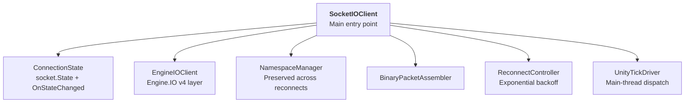
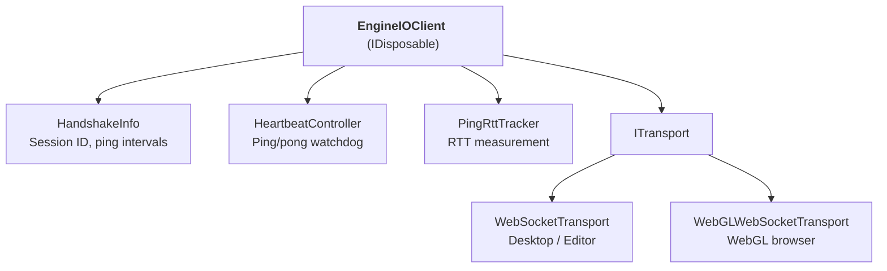
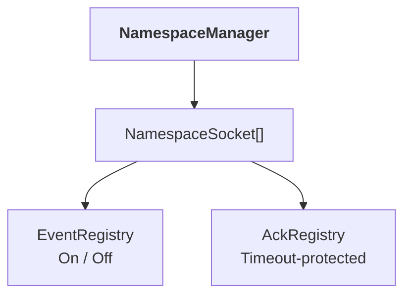
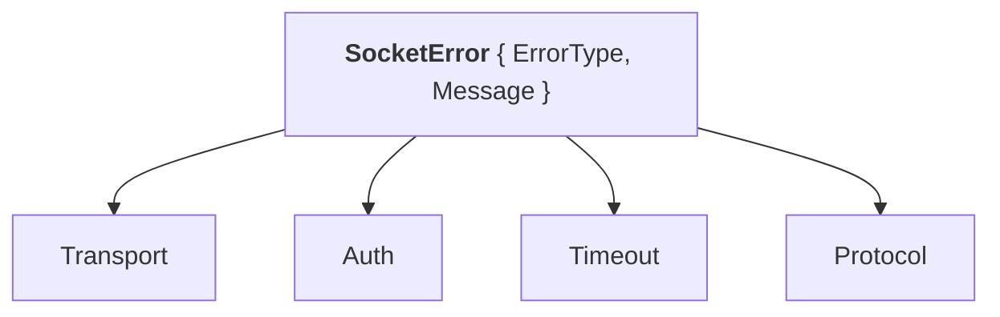
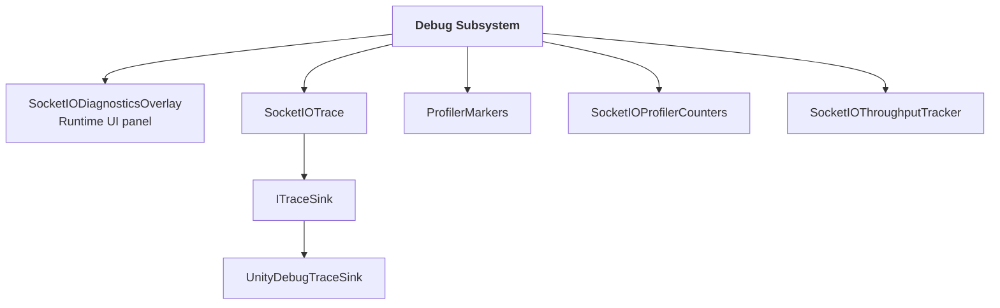
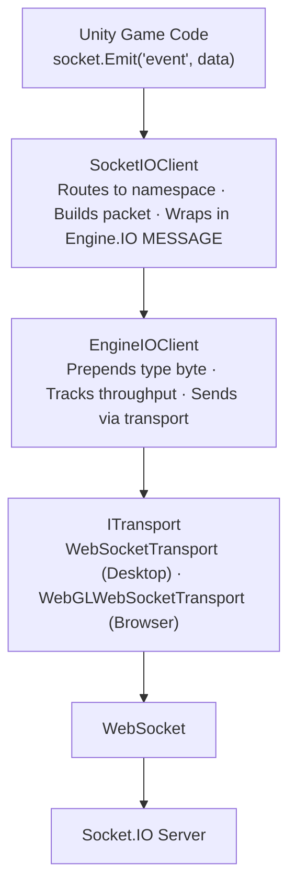
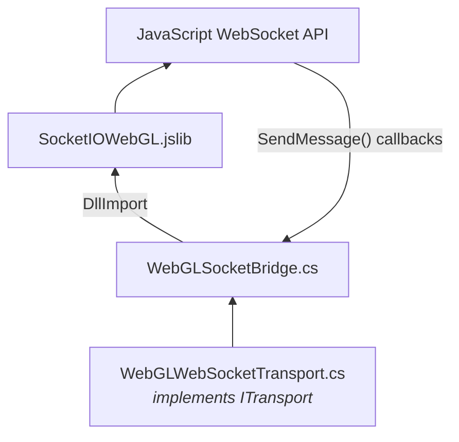
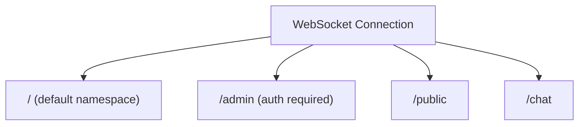

# SocketIOUnity Architecture

> Technical deep-dive into the internal architecture

---

## Component Hierarchy

### Core



### Engine.IO Layer



### Namespace Layer



### Error Handling



### Debug Subsystem



---

## Directory Structure (Repo Layout)

```
socketio-unity/                 # Repo root
├── README.md
├── CHANGELOG.md
├── API_STABILITY.md
├── CONTRIBUTING.md
│
├── Documentation~/             # Package documentation
│   ├── ARCHITECTURE.md
│   ├── BINARY_EVENTS.md
│   ├── DEBUGGING_GUIDE.md
│   ├── GETTING_STARTED.md
│   ├── RECONNECT_BEHAVIOR.md
│   └── WEBGL_NOTES.md
│
├── TestServer~/                # Node.js test servers
├── TestProject~/               # Standalone Unity test project
│
└── package/                    # UPM package root
    ├── package.json            # UPM manifest
    │
    ├── Runtime/                # Runtime code (included in builds)
    │   ├── SocketIOUnity.asmdef
    │   ├── AssemblyInfo.cs
    │   │
    │   ├── Core/
    │   │   ├── EngineIO/           # Engine.IO v4 protocol
    │   │   │   ├── EngineIOClient.cs
    │   │   │   ├── EngineMessage.cs
    │   │   │   ├── HandshakeInfo.cs
    │   │   │   ├── HeartbeatController.cs
    │   │   │   └── PingRttTracker.cs
    │   │   │
    │   │   ├── SocketIO/           # Socket.IO client layer
    │   │   │   ├── SocketIOClient.cs
    │   │   │   ├── ConnectionState.cs    ← connection lifecycle enum
    │   │   │   ├── SocketError.cs        ← typed error struct + ErrorType enum
    │   │   │   ├── NamespaceManager.cs
    │   │   │   ├── NamespaceSocket.cs
    │   │   │   ├── EventRegistry.cs
    │   │   │   ├── AckRegistry.cs
    │   │   │   ├── AckEntry.cs
    │   │   │   ├── ReconnectController.cs
    │   │   │   └── ReconnectConfig.cs
    │   │   │
    │   │   ├── Protocol/           # Packet parsing
    │   │   │   ├── SocketPacket.cs
    │   │   │   ├── SocketPacketParser.cs
    │   │   │   └── SocketPacketType.cs
    │   │   │
    │   │   └── Pooling/            # GC optimization
    │   │       ├── ListPool.cs
    │   │       └── ObjectPool.cs
    │   │
    │   ├── Debug/                  # Instrumentation
    │   │   ├── ProfilerMarkers.cs
    │   │   ├── SocketIOProfilerCounters.cs
    │   │   ├── SocketIOThroughputTracker.cs
    │   │   ├── SocketIOTrace.cs
    │   │   ├── TraceConfig.cs
    │   │   ├── TraceLevel.cs
    │   │   ├── TraceCategory.cs
    │   │   ├── TraceEvent.cs
    │   │   ├── ITraceSink.cs
    │   │   └── UnityDebugTraceSink.cs
    │   │
    │   ├── Serialization/          # Binary handling
    │   │   ├── BinaryPacketAssembler.cs
    │   │   ├── BinaryPacketBuilder.cs
    │   │   └── BinaryPacketBuilderPool.cs
    │   │
    │   ├── Transport/              # Platform abstraction
    │   │   ├── ITransport.cs
    │   │   ├── TransportFactory.cs
    │   │   ├── WebSocketTransport.cs
    │   │   ├── WebSocket.cs
    │   │   ├── WebGLWebSocketTransport.cs
    │   │   └── WebGLSocketBridge.cs
    │   │
    │   ├── UnityIntegration/       # Unity lifecycle
    │   │   ├── ITickable.cs
    │   │   ├── UnityTickDriver.cs
    │   │   └── UnityMainThreadDispatcher.cs
    │   │
    │   ├── Plugins/WebGL/
    │   │   └── SocketIOWebGL.jslib
    │   └── link.xml                    ← IL2CPP stripping preservation
    │
    ├── Editor/                     # Editor-only code
    │   ├── SocketIOUnity.Editor.asmdef
    │   ├── ProtocolEdgeCaseTests.cs
    │   └── SocketIONetworkHud.cs
    │
    ├── Tests/                      # Automated tests
    │   ├── Runtime/
    │   │   ├── BugRegressionTests.cs
    │   │   ├── ReconnectConfigTests.cs
    │   │   ├── LobbyStateIntegrationTests.cs
    │   │   └── SocketIOUnity.Tests.asmdef
    │   └── EditMode/               # Stress tests
    │       ├── StressTests.cs
    │       └── SocketIOUnity.Tests.Stress.asmdef
    │
    └── Samples~/                   # UPM importable samples
        ├── BasicChat/
        │   ├── BasicChatUI.cs
        │   ├── BasicChatScene.unity
        │   ├── SocketIOManager.cs              # Singleton + ShowDiagnostics toggle
        │   ├── SocketIODiagnosticsOverlay.cs   # Runtime diagnostics panel
        │   └── README.md
        ├── PlayerSync/             # Real-time multiplayer demo
        │   ├── README.md
        │   ├── PlayerSyncScene.unity
        │   └── Scripts/
        ├── Lobby/                  # Multiplayer lobby system
        │   ├── README.md
        │   ├── LobbyScene.unity
        │   ├── Scripts/
        │   └── Prefab/
        ├── LiveDemo/               # End-to-end lobby → match demo
        │   ├── README.md
        │   ├── LiveDemo.unity
        │   └── Scripts/
        ├── MirrorIntegration/      # Socket.IO + Mirror hybrid architecture
        │   ├── README.md
        │   ├── MIRROR_INTEGRATION.md
        │   ├── MirrorIntegrationScene.unity
        │   ├── Scripts/
        │   └── Prefab/
        ├── BinaryEventTest.cs
        ├── MainThreadDispatcherTest.cs
        ├── NamespaceAuthTest.cs
        ├── TraceDemo.cs
        └── WebGLTestController.cs
```

> **Note**: `Samples~/` contains UPM-style samples importable via Package Manager.

---

## Layer Separation

### Transport Layer (`Transport/`)

| Class | Platform | Purpose |
|-------|----------|---------|
| `ITransport` | All | Transport interface |
| `WebSocketTransport` | Desktop/Editor | Native `System.Net.WebSockets` |
| `WebGLWebSocketTransport` | WebGL | Browser WebSocket via jslib |
| `TransportFactory` | All | Auto-selects by platform |
| `WebSocket.cs` | Desktop | Full WebSocket implementation |

### Engine.IO Layer (`Core/EngineIO/`)

- **Handshake negotiation** — Session ID, ping intervals
- **Heartbeat management** — Ping/pong keep-alive
- **RTT tracking** — Round-trip time measurement via `PingRttTracker`
- **Resource cleanup** — Implements `IDisposable`

### Socket.IO Layer (`Core/SocketIO/`)

- **Event registration** (`On` / `Off` / `Emit`)
- **Namespace management** — Multiplexed channels
- **Acknowledgements** — Timeout-protected request/response
- **Auth handshakes** — Per-namespace authentication

### Debug Layer (`Debug/` + `Samples~/BasicChat/`)

- **Diagnostics overlay** — `SocketIODiagnosticsOverlay` runtime UI panel; toggle via `SocketIOManager.Instance.ShowDiagnostics = true`
- **Packet tracing** — `SocketIOTrace` with configurable levels
- **Profiler markers** — Zero-cost when disabled (`SOCKETIO_PROFILER`)
- **Profiler counters** — Real-time metrics (`SOCKETIO_PROFILER_COUNTERS`)

---

## Data Flow



---

## Tick-Based Execution

All processing happens on Unity's main thread via `UnityTickDriver`:

```csharp
void Update()
{
    foreach (var tickable in _tickables)
        tickable.Tick();
}
```

**Tickable components:**
- `EngineIOClient` — Dispatches transport messages
- `HeartbeatController` — Checks ping timeout (uses `Time.time`)
- `ReconnectController` — Fires reconnect attempts
- `SocketIOThroughputTracker` — Updates per-second metrics

**Benefits:**
- ✅ No background threads
- ✅ Unity lifecycle safety
- ✅ Deterministic execution order
- ✅ Uses `Time.time` for Unity-compatible timing

---

## Memory Management

### Pooling (`Core/Pooling/`)

| Pool | Purpose |
|------|---------|
| `ListPool<T>` | Temporary lists for iteration |
| `ObjectPool<T>` | Reusable objects |
| `BinaryPacketBuilderPool` | Binary packet construction |

```csharp
var list = ListPool<byte[]>.Rent();
// Use...
ListPool<byte[]>.Return(list);
```

---

## Resource Cleanup

`EngineIOClient` implements `IDisposable` for proper cleanup:

```csharp
public void Dispose()
{
    Disconnect();
    _transport?.Close();
    // Clean up event handlers, timers, etc.
}
```

**EventRegistry** supports unsubscription to prevent memory leaks:

```csharp
Action<string> handler = data => Debug.Log(data);
socket.On("event", handler);
socket.Off("event", handler);  // Remove specific handler
socket.Off("event");           // Remove all handlers for event
```

---

## Platform Abstraction

### Desktop/Editor

Uses `System.Net.WebSockets.ClientWebSocket`:
- Full async/await support
- Native TLS handling
- Binary message support

### WebGL

Uses browser WebSocket via JavaScript interop:



---

## Namespace Architecture

All namespaces share a single WebSocket:



Each namespace has independent:
- Event handlers (`EventRegistry`)
- ACK registry (`AckRegistry`)
- Connection state
- Auth payload

---

## Debug & Instrumentation

### Trace Levels

| Level | Output |
|-------|--------|
| `Off` | Disabled (default) |
| `Errors` | Only errors |
| `Protocol` | Errors + packets |
| `Verbose` | Full debug |

### Profiler Defines

| Define | Feature |
|--------|---------|
| `SOCKETIO_PROFILER` | Profiler markers (~20ns overhead) |
| `SOCKETIO_PROFILER_COUNTERS` | Real-time counters |

### Custom Trace Sinks

```csharp
public class FileTraceSink : ITraceSink
{
    public void Emit(TraceEvent evt)
    {
        File.AppendAllText("socket.log", evt.ToString());
    }
}
SocketIOTrace.SetSink(new FileTraceSink());
```

---

## Key Design Decisions

| Decision | Rationale |
|----------|-----------|
| Single connection | Follows Socket.IO protocol spec |
| Tick-driven processing | Unity main-thread safety |
| Transport abstraction | Platform independence |
| No background threads | Avoids Unity lifecycle issues |
| Pooled allocations | Minimizes GC pressure |
| `IDisposable` pattern | Proper resource cleanup |
| `Time.time` for timing | Unity-compatible, pause-aware |
| `On`/`Off` event API | Prevents memory leaks |
