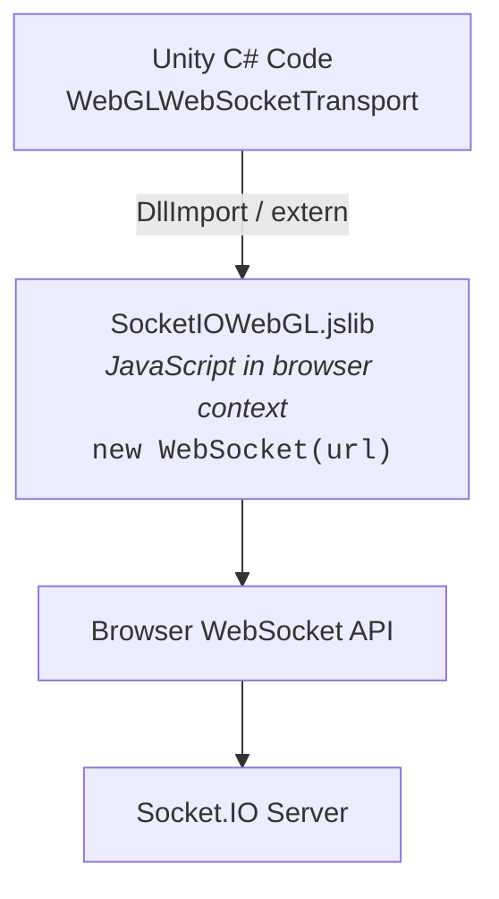

# WebGL Implementation Notes

> Platform-specific considerations for browser builds

---

## ✅ Status: Production Verified

WebGL support has been **fully tested and verified** as of January 2026.

| Feature | Status | Notes |
|---------|--------|-------|
| Connect | ✅ | Stable connection to Socket.IO servers |
| Events | ✅ | Text events work correctly |
| ACKs | ✅ | Acknowledgements verified |
| Namespaces | ✅ | `/`, `/webgl`, `/admin` all working |
| Binary receive | ✅ | Server → Client binary data works |
| Binary emit | ✅ | Client → Server binary data works |
| Reconnect | ✅ | Clean disconnect/reconnect cycles |
| Auth | ✅ | Namespace authentication verified |

---

## Architecture

WebGL uses a JavaScript bridge instead of `System.Net.WebSockets`:



---

## Components

### SocketIOWebGL.jslib

A JavaScript library merged into the WebGL build. It contains **two sets of functions**:

1. **SocketIO-specific functions** (used by `WebGLWebSocketTransport`):
   - `SocketIO_WebSocket_Create`
   - `SocketIO_WebSocket_SendText`
   - `SocketIO_WebSocket_SendBinary`
   - `SocketIO_WebSocket_Close`

2. **NativeWebSocket functions** (required for WebSocket.cs compilation):
   - `WebSocketAllocate`, `WebSocketConnect`, `WebSocketClose`
   - `WebSocketSend`, `WebSocketSendText`, `WebSocketGetState`
   - `WebSocketSetOnOpen`, `WebSocketSetOnMessage`, etc.

> ⚠️ **Important:** Both sets must be present in the jslib, even if only one is actively used. The WebGL linker requires all `[DllImport]` symbols to exist.

### WebGLSocketBridge.cs

MonoBehaviour receiving callbacks from JavaScript and routing to transports:

```csharp
public sealed class WebGLSocketBridge : MonoBehaviour
{
    public static WebGLSocketBridge Instance { get; private set; }

    // Register/unregister handlers per socket ID
    public void Register(string socketId, Action onOpen, ...);
    public void Unregister(string socketId);

    // Called by JavaScript via SendMessage
    public void JSOnOpen(string socketId);
    public void JSOnClose(string socketId);
    public void JSOnError(string socketId);
    public void JSOnText(string payload);   // Format: "socketId:message"  ⚠️ see routing caveat below
    public void JSOnBinary(string payload); // Format: "socketId,ptr,length"
}
```

### WebGLWebSocketTransport.cs

`ITransport` implementation for WebGL (only compiles in WebGL builds):

```csharp
internal sealed class WebGLWebSocketTransport : ITransport
{
    private readonly string _id = Guid.NewGuid().ToString();

    [DllImport("__Internal")]
    private static extern void SocketIO_WebSocket_Create(string id, string url);

    [DllImport("__Internal")]
    private static extern void SocketIO_WebSocket_SendText(string id, string msg);

    [DllImport("__Internal")]
    private static extern void SocketIO_WebSocket_SendBinary(string id, IntPtr data, int len);

    [DllImport("__Internal")]
    private static extern void SocketIO_WebSocket_Close(string id);
}
```

### WebGLTestController.cs

Sample controller for testing WebGL builds:

```csharp
public class WebGLTestController : MonoBehaviour
{
    [SerializeField] private string serverUrl = "http://localhost:3000";
    [SerializeField] private bool useWebglNamespace = true;
    
    // Connect, Disconnect, SendPing, SendMessage methods
    // OnGUI for runtime testing UI
}
```

---

### JSOnText routing (fixed in v1.6.0)

`JSOnText` splits the `"<socketId>:message"` frame deterministically at the **first** colon (the socket id is a colon-free GUID, so the message body may safely contain any number of colons) and looks the socket id up directly in `_textHandlers`. A message with an unroutable or unknown socket id is dropped with a `Debug.LogWarning`, not silently misparsed or routed to the wrong socket.

This replaced an earlier "first colon, index < 40" heuristic with a silent last-active-socket fallback, which could misroute cross-socket data in multi-socket scenarios — see the CHANGELOG's `[1.6.0]` entry (security audit finding #2) and `WebGLBridgeRoutingTests` for coverage.

---

## Binary Message Handling

JavaScript handles ArrayBuffer messages with socket ID routing:

```javascript
ws.onmessage = function(e) {
    if (typeof e.data === "string") {
        // Include socket ID prefix for routing
        SendMessage("WebGLSocketBridge", "JSOnText", id + ":" + e.data);
    } else {
        // Binary: allocate memory, copy, send pointer with socket ID
        var bytes = new Uint8Array(e.data);
        var ptr = _malloc(bytes.length);
        HEAPU8.set(bytes, ptr);
        SendMessage("WebGLSocketBridge", "JSOnBinary", id + "," + ptr + "," + bytes.length);
        _free(ptr);
    }
};
```

---

## CORS Requirements

Your Socket.IO server must allow CORS for WebGL:

```javascript
const io = new Server(httpServer, {
    cors: {
        origin: "*",  // Or your specific domain
        methods: ["GET", "POST"]
    }
});
```

---

## IL2CPP Stripping (link.xml)

WebGL uses IL2CPP, which aggressively strips unused code. Types only accessed via reflection (e.g. JSON deserialization) can be removed, causing silent failures at runtime.

The package includes `package/Runtime/link.xml` to preserve critical runtime types:

```xml
<linker>
  <assembly fullname="SocketIOUnity">
    <type fullname="SocketIOUnity.UnityIntegration.UnityMainThreadDispatcher" preserve="all"/>
    <type fullname="SocketIOUnity.UnityIntegration.UnityTickDriver" preserve="all"/>
  </assembly>
</linker>
```

If your own data models are deserialized from Socket.IO JSON (e.g. room state, player data), add a `link.xml` in your scripts folder:

```xml
<linker>
  <assembly fullname="Assembly-CSharp">
    <type fullname="YourNamespace.YourDataModel" preserve="all"/>
  </assembly>
</linker>
```

The Lobby sample includes its own `link.xml` preserving `RoomState` and `LobbyPlayer` as a reference.

---

## Build Setup

1. **jslib placed correctly:** `package/Runtime/Plugins/WebGL/SocketIOWebGL.jslib`
2. **Bridge GameObject exists:** The `WebGLSocketBridge` MonoBehaviour must exist in scene
3. **link.xml present:** `package/Runtime/link.xml` preserves types from IL2CPP stripping (included in package)
4. **Platform check:** Use `TransportFactory` for automatic selection

```csharp
// TransportFactory handles this
#if UNITY_WEBGL && !UNITY_EDITOR
    return new WebGLWebSocketTransport();
#else
    return new WebSocketTransport();
#endif
```

---

## Testing

### Local Development

1. Build WebGL from Unity
2. Serve via HTTP (not `file://`):
   ```bash
   cd /path/to/build && npx serve -p 8080
   ```
3. Start Socket.IO server with CORS enabled
4. Open `http://localhost:8080` in browser

### Debug in Browser

1. Open browser Developer Tools (F12)
2. Console → Filter by "WebSocket" or search for Socket.IO logs
3. Network tab → WS filter to see WebSocket frames

---

## ⚠️ Browser Cache Warning

When iterating on WebGL builds, the browser may serve **cached JS/WASM files** from previous builds. This can cause:

- Old code running despite new builds
- Mysterious connection loops
- Features not appearing after changes

**Solutions:**
- Force refresh: `Cmd+Shift+R` (Mac) or `Ctrl+Shift+R` (Windows)
- Use Incognito/Private browsing mode
- Clear browser cache for localhost
- Use different browser for clean testing

---

## Troubleshooting

### "WebGLSocketBridge not found"

The GameObject must exist in your scene:

```csharp
// Ensure in Awake or Start
if (WebGLSocketBridge.Instance == null)
{
    var go = new GameObject("WebGLSocketBridge");
    go.AddComponent<WebGLSocketBridge>();
    DontDestroyOnLoad(go);
}
```

### "SocketIO_WebSocket_Create is not defined"

The jslib file is not included in the build:
- Check file is in `Plugins/WebGL/`
- Check meta file has correct platform settings (WebGL only)

### "undefined symbol: WebSocketAllocate"

The jslib is missing NativeWebSocket functions:
- Ensure `SocketIOWebGL.jslib` contains **both** SocketIO and NativeWebSocket function sets
- The WebGL linker needs all `[DllImport]` symbols, even if unused at runtime

### WebSocket connection fails

Check browser console:
- CORS errors → Fix server configuration
- Mixed content → Use wss:// on https:// pages
- CSP violations → Update Content-Security-Policy header

### Connection loops (rapid connect/disconnect)

Usually caused by:
1. **Browser cache** serving old code (force refresh)
2. **Duplicate event subscriptions** (use named methods, not anonymous lambdas)
3. **Socket not properly disposed** before reconnecting

---

## Namespace Usage

Namespaces work the same as desktop, but join AFTER root connection:

```csharp
_socket.OnConnected += () =>
{
    // Join namespace after root is connected
    var webglNs = _socket.Of("/webgl");
    
    webglNs.OnConnected += () =>
    {
        Debug.Log("Namespace connected!");
    };
    
    webglNs.On("message", (string data) =>
    {
        Debug.Log($"Message: {data}");
    });
};
```

---

## Production Checklist

- [x] Use `wss://` (TLS) for any connection where auth tokens or session data are passed
- [x] Test binary message receive
- [x] Test reconnection after disconnect
- [x] Test namespace authentication
- [x] Verify clean disconnect/reconnect cycles
- [x] Verify IL2CPP stripping does not remove runtime types (`link.xml`)
- [x] Verify data model classes preserved for JSON deserialization
- [x] Test with production server (wss://) — LiveDemo deployed on Render
- [x] Verify CORS headers in production
- [x] Verify compressed `.unityweb` build assets load correctly
- [x] ACK array wrapping handled for WebGL lobby flows
- [x] Load testing with sustained connections
