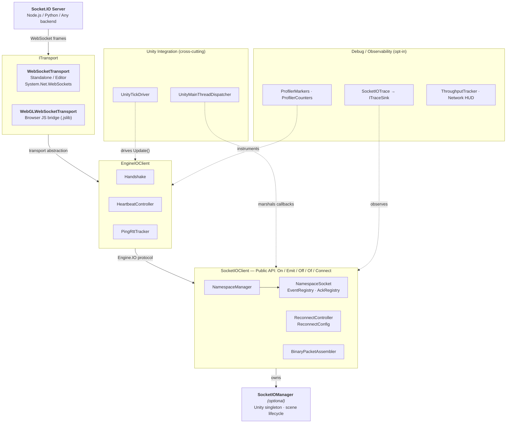

<div align="center">

# socketio-unity

**Real-time multiplayer infrastructure for Unity** — lobby systems, player synchronization, and live backend communication, all over Socket.IO v4.

WebGL-ready. Production-tested. Zero paid dependencies.

[](https://github.com/Magithar/socketio-unity/actions/workflows/ci.yml)
[](https://github.com/Magithar/socketio-unity/releases)
[](https://unity.com)
[](Documentation~/WEBGL_NOTES.md)
[](LICENSE)

<!-- TODO: Replace with lobby-demo.gif once recorded -->
<!--  -->

**Lobby with host migration** · **Real-time player sync** · **WebGL browser multiplayer** · **Binary payloads** · **Reconnect recovery**

---

**Getting Started** &nbsp;·&nbsp;
📖 [Start Here](Documentation~/GETTING_STARTED.md) &nbsp;·&nbsp;
⚡ [Quick Start](#-quick-start-2-minutes) &nbsp;·&nbsp;
🎬 [Demo](#-demo) &nbsp;·&nbsp;
🚀 [Installation](#-installation) &nbsp;·&nbsp;
📦 [Dependencies](#-dependencies)

**Usage** &nbsp;·&nbsp;
🧠 [API Guide](#-usage-current-api) &nbsp;·&nbsp;
🔒 [API Stability](#-api-stability) &nbsp;·&nbsp;
🧱 [Architecture](#-architecture-overview) &nbsp;·&nbsp;
⚙️ [Component Hierarchy](#component-hierarchy) &nbsp;·&nbsp;
🔄 [Connection State](#connection-state-tracking) &nbsp;·&nbsp;
🛑 [Error Handling](#typed-error-handling)

**Samples** &nbsp;·&nbsp;
💬 [Basic Chat](#-basic-chat-sample) &nbsp;·&nbsp;
🎮 [PlayerSync](#-playersync-sample) &nbsp;·&nbsp;
🏠 [Lobby](#-lobby-sample) &nbsp;·&nbsp;
🎬 [LiveDemo](#-livedemo-sample)

**Platform & Production** &nbsp;·&nbsp;
📦 [Platforms](#-supported-platforms) &nbsp;·&nbsp;
✅ [WebGL](#-webgl-status-production-verified) &nbsp;·&nbsp;
🛡 [Production Readiness](#-production-readiness)

**Developer Tools** &nbsp;·&nbsp;
🩺 [Diagnostics Overlay](#-diagnostics-overlay) &nbsp;·&nbsp;
🔬 [Profiler Integration](#-unity-profiler-integration) &nbsp;·&nbsp;
📊 [Profiler Counters](#-unity-profiler-counters) &nbsp;·&nbsp;
🔍 [Packet Tracing](#-packet-tracing) &nbsp;·&nbsp;
🧪 [Testing](#-development--testing) &nbsp;·&nbsp;
🖥 [Test Server](#test-server-setup)

**Project** &nbsp;·&nbsp;
🚧 [Status](#-implementation-status) &nbsp;·&nbsp;
📝 [Changelog](CHANGELOG.md) &nbsp;·&nbsp;
🤝 [Contributing](#-contributing) &nbsp;·&nbsp;
📄 [License](#-license)

---

**New here?** Read [Getting Started](Documentation~/GETTING_STARTED.md) — zero to multiplayer in 5 minutes, step by step.

</div>

---

## ⚡ Quick Start (2 minutes)

**1. Install via Unity Package Manager** (`Window > Package Manager` → `+` → `Add package from git URL`):

```
https://github.com/Magithar/socketio-unity.git
```

**2. Connect and send events:**

```csharp
var socket = SocketIOManager.Instance.Socket;

socket.OnConnected += () => Debug.Log("Connected!");

socket.On("chat", msg => Debug.Log("Server: " + msg));

socket.Connect("ws://localhost:3002");
socket.Emit("chat", "Hello from Unity!");
```

**3. Run the test server:**

```bash
cd TestServer~ && npm install && npm run start:basicchat
```

Open the **Basic Chat** sample and press Play. → [Full guide](#-basic-chat-sample)

---

## What Can You Build With This?

| Use Case | How |
|----------|-----|
| **Multiplayer lobby system** | Create/join rooms, ready-up, host migration, reconnect recovery — [Lobby sample included](#-lobby-sample) |
| **Real-time player sync** | Position, rotation, state sync across players at 20Hz — [PlayerSync sample included](#-playersync-sample) |
| **WebGL browser multiplayer** | Same code runs in browser builds with zero changes — [WebGL verified](#-webgl-status-production-verified) |
| **Live backend communication** | Chat, notifications, dashboards, admin panels — [Basic Chat sample included](#-basic-chat-sample) |
| **Mobile multiplayer** | Android & iOS with touch input and runtime server config |
| **Signaling layer for Mirror/Netcode** | Use Socket.IO for lobby & matchmaking, hand off to gameplay transport |

---

## Why socketio-unity?

Most Unity Socket.IO clients are either closed-source assets, incomplete protocol ports, or tied to a specific platform. This project was built to fill that gap.

| Problem in existing clients | socketio-unity solution |
|-----------------------------|-------------------------|
| Closed-source or paid assets | Fully open-source (MIT), clean-room implementation |
| Incomplete protocol support | Socket.IO v4 + Engine.IO v4, binary events, namespaces, ACKs |
| WebGL incompatibility | Dedicated JavaScript transport bridge |
| Reconnect instability | Engine state fully recreated on each reconnect cycle |
| GC spikes in gameplay | Object pooling, binary buffer reuse |
| Hard to debug | Profiler markers, counters, configurable trace system |

---

## Comparison

| Feature | socketio-unity | Typical Unity Socket.IO Asset |
|---------|---------------|-------------------------------|
| Open source | ✅ MIT | ❌ Often closed-source |
| Socket.IO v4 protocol | ✅ Full implementation | ⚠️ Partial / outdated |
| WebGL support | ✅ Verified | ⚠️ Often broken |
| Binary payloads | ✅ | ⚠️ Limited |
| Namespace multiplexing | ✅ | ⚠️ Sometimes missing |
| ACK callbacks with timeout | ✅ | ⚠️ Partial |
| Automatic reconnect | ✅ Configurable (ReconnectConfig) | ⚠️ Basic or hardcoded |
| Unity Profiler integration | ✅ Markers + counters | ❌ |
| Clean-room implementation | ✅ | ❌ Unknown |
| CI-tested on every commit | ✅ GitHub Actions | ❌ Rare |

> If you're building real-time multiplayer in Unity — lobby systems, player sync, or live backend features — and need a transparent, inspectable networking layer, this project is built for that.

---

## 🎬 Demo

| Sample | Video |
|--------|-------|
| Basic Chat | [▶ Watch on YouTube](https://youtu.be/7dU89B9O50c) |
| Player Sync — WebGL Multiplayer | [▶ Watch on YouTube](https://www.youtube.com/watch?v=pdLP2jB7iEE) |

---

> ✅ **Stable for production use** — Public API frozen for v1.x

**Current:** v1.2.0 (2026-03-18) + unreleased — Typed errors, connection state tracking, diagnostics overlay, LiveDemo sample, dedicated per-sample servers, and WebSocket lifecycle hardening.

Open-source, clean-room Socket.IO v4 client for Unity — written from scratch against the public
protocol spec with no dependency on paid or closed-source assets.
Provides a familiar **event-based `On` / `Emit` API** across **Standalone, WebGL, and Mobile** builds.

> ⚠️ **Transport scope:** This client uses **WebSocket transport only**. Engine.IO long-polling is intentionally not supported.

---

## 🚧 Implementation Status

### 🔜 Unreleased (post v1.2.0)

* **Typed `SocketError`** — `OnError` now delivers a `SocketError` struct with `ErrorType` (Transport, Auth, Timeout, Protocol) and `Message`, replacing raw strings
* **`ConnectionState` tracking** — `socket.State` property (`Disconnected` / `Connecting` / `Connected` / `Reconnecting`) and `OnStateChanged` event for reactive UI
* **Diagnostics Overlay** — Runtime in-game panel (`SocketIOManager.Instance.ShowDiagnostics = true`) showing state, RTT, namespace count, pending ACKs, and live event log
* **Namespace preservation across reconnects** — `On()` handlers and namespace registrations survive reconnect cycles without re-registration
* **WebSocket lifecycle hardening** — Improved reconnect controller, race condition guards, and proper event rebinding on new socket instances
* **LiveDemo sample** — End-to-end lobby → match flow combining Lobby and PlayerSync in a single scene with `GameOrchestrator` layer toggling
* **Dedicated per-sample servers** — Each sample now has its own server on a dedicated port (`basicchat-server.js` :3002, `playersync-server.js` :3003, `lobby-server.js` :3001, `server.js` :3000 for binary/auth tests)
* **WebGL clipboard plugin** — Native clipboard support for WebGL builds
* **Stress tests** — EditMode tests for high packet rate, large binary bursts (10 MB), ACK stress (100 pending), reconnect storms (50 rapid cycles), and memory footprint validation
* **Lobby integration tests** — Runtime tests for socket state invariants and namespace connection timing

### ✅ v1.2.0 Milestone (2026-03-18)

* **Lobby Sample** - Production multiplayer lobby with host migration, session identity, reconnect grace window, and three-layer architecture
* **UPM Samples** - All three samples now visible in Package Manager Samples tab

### ✅ v1.1.2 Milestone (2026-03-05)

* **Reconnection Stability** - `CreateFreshEngine()` fully recreates engine state on each reconnect; prevents stale state, collection-modification crashes, and silently dropped namespaces after reconnect
* **PlayerNetworkSync Sample** - Re-attaches socket event handlers on reconnect to align with core reconnection fixes

### ✅ v1.1.1 Milestone (2026-02-28)

* **PlayerSync RemotePlayer Prefab Fixes** - Canvas render mode corrected to World Space, scale and size restored
* **BillboardCanvas Script** - Camera-facing label that always faces the viewer regardless of player direction

### ✅ v1.1.0 Milestone (2026-02-28)

* **PlayerSync Sample** - Production-grade multiplayer synchronization (9 components, 2 scenes, 3 Node.js servers)
* **ReconnectConfig** - Inspector-configurable backoff with jitter, factory presets, defensive copy
* **Mobile Support** - Android / iOS touch input, runtime URL configuration, dedicated mobile scene
* **CI Pipeline** - GitHub Actions + game-ci/unity-test-runner on every push/PR

### ✅ v1.0.0 Milestone (2026-01-29)

* **API Stability Contract** - Public API frozen for v1.x releases
* **Basic Chat Sample** - Production-ready Hello World onboarding experience
* **Protocol Hardening** - Edge case handling and malformed packet protection
* **Namespace Disconnect Correctness** - Reliable multi-namespace lifecycle management
* **Scene/Domain Reload Safety** - Unity Editor workflow compatibility

### ✅ Implemented

* Engine.IO v4 handshake (WebSocket-only)
* Engine.IO heartbeat / ping–pong watchdog
* Socket.IO v4 packet framing & parsing
* Event-based API (`On`, `Emit`, `Off`, `Of`)
* Default namespace (`/`)
* Custom namespaces (`/admin`, `/public`, etc.)
* Namespace multiplexing over a single connection
* **Namespace preservation across reconnects** — `On()` handlers survive without re-registration
* Acknowledgement callbacks (ACKs)
* Automatic reconnect with configurable exponential backoff
* **ReconnectConfig** (v1.1.0) — Inspector-configurable backoff with jitter and factory presets
* **ConnectionState** — `socket.State` property + `OnStateChanged` event (Disconnected / Connecting / Connected / Reconnecting)
* **Typed `SocketError`** — `OnError` delivers `SocketError { ErrorType, Message }` (Transport / Auth / Timeout / Protocol)
* Intentional vs unintentional disconnect handling
* Ping-timeout–triggered reconnect
* Standalone (Editor / Desktop) support
* **Binary payload support** (receive & emit)
* **Auth per namespace** (handshake extensions)
* **Unity Profiler markers** (zero-cost when disabled, via `SOCKETIO_PROFILER` define)
* **Unity Profiler counters** (live metrics, via `SOCKETIO_PROFILER_COUNTERS` define)
* **Diagnostics Overlay** (`SocketIOManager.Instance.ShowDiagnostics = true`) — runtime state, RTT, namespace count, ACK count, event log
* **Packet tracing / debug tooling** (`SocketIOTrace`)
* **Unity main-thread dispatch** (`UnityMainThreadDispatcher`)
* **Memory pooling & GC optimization** (`ListPool`, `ObjectPool`, `BinaryPacketBuilderPool`)
* **RTT tracking** (`PingRttTracker` for round-trip latency measurement)
* **ACK timeout support** (configurable timeout with automatic expiration cleanup)
* **IDisposable pattern** (`SocketIOClient`, `EngineIOClient` for proper resource cleanup)
* **Shutdown() method** (clean disconnect with full state reset)
* **Editor Network HUD** (real-time Scene View overlay via `SocketIO → Toggle Network HUD`)
* **Throughput tracking** (`SocketIOThroughputTracker` for bandwidth monitoring)
* **Automated test suite** — protocol edge cases, bug regressions, reconnect config, lobby integration, EditMode stress tests

### ✅ WebGL Support (Production Verified)

* WebGL JavaScript bridge fully tested and operational
* Namespace support verified (`/`, `/webgl`, `/admin`)
* Binary data reception confirmed
* Reconnection behavior validated in browser

---

## 🎯 Goals & Principles

* Provide a **transparent, inspectable, and extensible** Socket.IO client for Unity
* Maintain **protocol correctness** over undocumented hacks
* Ensure **identical behavior across Standalone and WebGL**
* Remain **clean-room compliant** and legally safe
* Serve as a long-term **community-driven alternative** to closed-source solutions

**Non-Goals:**
* Supporting Socket.IO v1 or v2
* Supporting Engine.IO long-polling
* Copying or mirroring any existing Socket.IO client implementation
* Being a drop-in replacement for any paid asset

---

## 🛡 Production Readiness

| Requirement | Status |
|-------------|--------|
| Stable public API (v1.x frozen) | ✅ |
| CI-validated (Unity 2022.3 LTS) | ✅ |
| Protocol edge-case tested (38 tests) | ✅ |
| Bug regression tests | ✅ |
| WebGL verified | ✅ |
| Mobile verified (Android / iOS) | ✅ |
| Configurable reconnect (ReconnectConfig) | ✅ |
| No GC spikes (object pooling) | ✅ |
| Main-thread safe (all callbacks) | ✅ |
| Domain reload safe | ✅ |
| Clean-room / legally safe | ✅ |
| IDisposable / no resource leaks | ✅ |

---

## 📦 Supported Platforms

| Platform                | Status               |
| ----------------------- | -------------------- |
| Unity Editor            | ✅                    |
| Windows / macOS / Linux | ✅                    |
| WebGL                   | ✅ (verified)         |
| Mobile (Android / iOS)  | ✅ (verified)         |

### Socket.IO / Engine.IO Version Compatibility

| Server Version | Supported |
|----------------|-----------|
| Socket.IO v4.x | ✅ |
| Socket.IO v3.x | ❌ |
| Socket.IO v2.x | ❌ |
| Engine.IO v4 (WebSocket) | ✅ |
| Engine.IO long-polling | ❌ intentionally excluded |

### Minimum Unity Version

| Feature | Minimum Version |
|---------|-----------------|
| Core functionality | Unity 2019.4 LTS |
| Newtonsoft.Json (built-in) | Unity 2020.1+ |
| Profiler Counters | Unity 2020.2+ |

---

## 🔒 API Stability

✅ **Stable for v1.0.0+**  
Core APIs (`Connect`, `Emit`, `On`, `Off`, `Of`, `Disconnect`) are **guaranteed stable** and won't break in v1.x releases.

⚠️ **May change in minor releases**  
Debugging tools (`SocketIOTrace`, profiler APIs) may evolve as we improve developer experience.

📖 **Full Details**: See [API_STABILITY.md](API_STABILITY.md) for the complete stability contract.

---

## 🚀 Installation

### Option 1: Unity Package Manager (Git URL) — Recommended

1. Open Unity's Package Manager (`Window > Package Manager`)
2. Click `+` → `Add package from git URL`
3. Enter: `https://github.com/Magithar/socketio-unity.git`

### Option 2: Manual Installation

1. Download or clone this repository
2. Copy the entire repository folder into your Unity project's `Packages/` directory
   (or add it as a local package via Package Manager → `Add package from disk` → `package.json`)

---

## 📦 Dependencies

### Required

| Package | Source | License | Purpose |
|---------|--------|---------|---------|
| **Newtonsoft.Json** | `com.unity.nuget.newtonsoft-json` | MIT | JSON serialization |
| **NativeWebSocket** | [endel/NativeWebSocket](https://github.com/endel/NativeWebSocket) | Apache 2.0 | WebSocket transport |

**Installation:**

1. **Newtonsoft.Json** — Included by default in Unity 2020.1+. For older versions, install via Package Manager.

2. **NativeWebSocket** — Install via Package Manager using git URL:
   ```
   https://github.com/endel/NativeWebSocket.git#upm
   ```

**Note on NativeWebSocket:** This project includes a modified version of `WebSocket.cs` from NativeWebSocket with Unity domain reload safety improvements (v1.0.1 bug fix). All modifications are documented in [NOTICE.md](NOTICE.md) for Apache 2.0 license compliance.

### Built-in (No Installation Needed)

| Dependency | Platform | Purpose |
|------------|----------|---------|
| **System.Net.WebSockets** | Standalone / Editor | Native WebSocket transport |
| **Browser WebSocket API** | WebGL | Via `SocketIOWebGL.jslib` bridge |

### Transport Abstraction

All network code is accessed through the `ITransport` interface, enabling:
- Platform-specific implementations
- Easy mocking for tests
- Future transport options (e.g., polling fallback)

---

## 🧠 Usage (Current API)

### Scene Setup

1. **Create an empty GameObject** in your scene (e.g., `SocketIOManager`)
2. **Attach the `SocketIOManager` script** to it
3. **(Optional) For testing:**
   - Attach `BinaryEventTest` or `NamespaceAuthTest` scripts from `Samples~/`
4. **Configure the URL** in your connecting script (each sample sets its own server URL)

The `SocketIOManager` uses Unity's singleton pattern and persists across scenes.

---

### Basic Connection

```csharp
var socket = SocketIOManager.Instance.Socket;

socket.OnConnected += () =>
{
    Debug.Log("🎮 Game connected");
};

socket.On("chat", data =>
{
    Debug.Log(data);
});

socket.Emit("chat", "Hello from Unity!");
```

---

### Connection State Tracking

Track the socket lifecycle with `ConnectionState` and `OnStateChanged`:

```csharp
var socket = SocketIOManager.Instance.Socket;

// Read current state at any time
if (socket.State == ConnectionState.Connected)
{
    socket.Emit("status", "online");
}

// React to state transitions
socket.OnStateChanged += (ConnectionState state) =>
{
    Debug.Log($"State → {state}");
    // Disconnected → Connecting → Connected
    // Connected → Reconnecting → Connected (on drop)
};

socket.OnDisconnected += () =>
{
    Debug.Log("Disconnected from server");
};
```

**States:**
| State | Meaning |
|-------|---------|
| `Disconnected` | Not connected (initial state, or after `Disconnect()`) |
| `Connecting` | Handshake in progress |
| `Connected` | Live and operational |
| `Reconnecting` | Connection lost, auto-reconnect active |

---

### Typed Error Handling

`OnError` delivers a `SocketError` struct with a category and message:

```csharp
socket.OnError += (SocketError err) =>
{
    switch (err.Type)
    {
        case ErrorType.Transport:
            Debug.LogError($"Network failure: {err.Message}");
            break;
        case ErrorType.Auth:
            Debug.LogError($"Authentication rejected: {err.Message}");
            break;
        case ErrorType.Timeout:
            Debug.LogWarning($"Server not responding: {err.Message}");
            break;
        case ErrorType.Protocol:
            Debug.LogWarning($"Bad packet: {err.Message}");
            break;
    }
};
```

**Error Types:**
| Type | Cause | Typical Response |
|------|-------|------------------|
| `Transport` | WebSocket connection or send failure | Check server / network |
| `Auth` | Server rejected connection (authentication) | Verify credentials |
| `Timeout` | Heartbeat timeout (server stopped responding) | Auto-reconnect handles this |
| `Protocol` | Malformed or unparseable packet | Check server compatibility |

---

### Event Unsubscription (`Off()`)

Always unsubscribe from events when destroying GameObjects to prevent memory leaks:

```csharp
public class MyComponent : MonoBehaviour
{
    private Action<string> chatHandler;
    private Action<byte[]> fileHandler;

    void Start()
    {
        var socket = SocketIOManager.Instance.Socket;

        // Store handler references for later cleanup
        chatHandler = (msg) => Debug.Log($"Chat: {msg}");
        fileHandler = (data) => Debug.Log($"File: {data.Length} bytes");

        socket.On("chat", chatHandler);
        socket.On("file", fileHandler);
    }

    void OnDestroy()
    {
        var socket = SocketIOManager.Instance?.Socket;
        if (socket != null)
        {
            // Unsubscribe to prevent memory leaks
            socket.Off("chat", chatHandler);
            socket.Off("file", fileHandler);
        }
    }
}
```

---

### Binary Events

Handle binary data (images, files, etc.) with typed handlers:

```csharp
// Receiving binary from server
socket.On("file", (byte[] data) =>
{
    Debug.Log($"📦 Received {data.Length} bytes");
    File.WriteAllBytes("received.bin", data);
});

// Receiving multiple binary attachments
socket.On("multi", (byte[] buf1) =>
{
    Debug.Log($"📦 First buffer: {buf1.Length} bytes");
});

// Binary with acknowledgement
socket.On("binary-ack", (byte[] data) =>
{
    Debug.Log($"📦 Binary ACK data: {data.Length} bytes");
});

// Emitting binary to server
byte[] payload = File.ReadAllBytes("data.bin");
socket.Emit("upload", payload, (response) =>
{
    Debug.Log($"✅ Server response: {response}");
});

// Emitting multiple values (binary + metadata)
// Note: Multiple binary attachments in a single emit is not currently supported.
// Use separate emits or combine data server-side.
```

---

### Namespace Usage

```csharp
var socket = SocketIOManager.Instance.Socket;

// Public namespace (no auth required)
var publicNs = socket.Of("/public");
publicNs.OnConnected += () =>
{
    Debug.Log("📢 /public connected");
};

// Admin namespace with authentication
var admin = socket.Of("/admin", new { token = "test-secret" });
admin.OnConnected += () =>
{
    Debug.Log("🔐 /admin connected");

    admin.Emit("ping", null, res =>
    {
        Debug.Log("🔐 admin ACK: " + res);
    });
};

// Handle auth failures (via event)
admin.On("connect_error", (err) =>
{
    Debug.LogError($"❌ /admin auth failed: {err}");
});
```

**Features:**
* Multiplexed over a single WebSocket connection
* Connected only after the root namespace (`/`)
* Automatically reconnected after disconnects
* Auth payload sent during namespace handshake

---

### Acknowledgement (ACK) Callbacks

```csharp
socket.Emit("getTime", null, response =>
{
    Debug.Log("⏱ Server time: " + response);
});

// With custom timeout (default: 5000ms)
socket.Emit("slowOperation", data, response =>
{
    if (response == null)
    {
        Debug.LogWarning("⏱ ACK timed out - no response from server");
    }
    else
    {
        Debug.Log("✅ Response: " + response);
    }
}, timeoutMs: 10000);
```

**Features:**
* Timeout-protected (callback receives `null` on timeout)
* Namespace-aware
* Automatically cleared on disconnect

**ACK Timeout Behavior:**
* When timeout expires, the callback is invoked with `null`
* The ACK is removed from the pending registry
* No retry is attempted - handle retry logic in your callback if needed

---

### Disconnect vs Shutdown

```csharp
var socket = SocketIOManager.Instance.Socket;

// Disconnect() - Intentional disconnect, can reconnect later
socket.Disconnect();
// - Stops auto-reconnect
// - Preserves namespace registrations
// - Can call Connect() again

// Shutdown() - Full cleanup, typically on application quit
socket.Shutdown();
// - Disconnects all namespaces
// - Clears all event handlers
// - Resets all internal state
// - Use in OnApplicationQuit or when completely done with socket
```

**When to use which:**
| Scenario | Method |
|----------|--------|
| User logs out, may log back in | `Disconnect()` |
| Switching servers | `Disconnect()` then `Connect(newUrl)` |
| Application quitting | `Shutdown()` |
| Disposing the socket permanently | `Shutdown()` + `Dispose()` |

---

### Reconnect Behavior

```csharp
// Automatic reconnection with exponential backoff
// No manual intervention needed
```

**Reconnects happen automatically when:**
* The server closes the connection
* A ping timeout occurs
* Network connectivity is lost

**Reconnects do NOT happen when:**
* `Disconnect()` is called intentionally
* The application is quitting

**Strategy:**
* Exponential backoff to avoid overwhelming the server
* Single reconnect loop (no duplicate attempts)
* Automatically stopped on successful connection

**Customization:**
By default, reconnection uses exponential backoff (1s → 2s → 4s → 8s → 16s → 30s max).
For custom behavior, see [Configuring Reconnection Behavior](#configuring-reconnection-behavior-v110) below.

---

### Configuring Reconnection Behavior (v1.1.0+)

`ReconnectConfig` gives you full control over the reconnect strategy:

```csharp
socket.ReconnectConfig = new ReconnectConfig
{
    initialDelay  = 1f,      // First retry after 1 second
    multiplier    = 2f,      // Double delay each attempt
    maxDelay      = 30f,     // Cap at 30 seconds
    maxAttempts   = -1,      // -1 = unlimited
    autoReconnect = true,
    jitterPercent = 0.1f,    // ±10% random variance — prevents thundering herd
};
```

**Factory presets:**

| Preset | Use case |
|--------|----------|
| `ReconnectConfig.Default()` | Matches v1.0.x behavior (1s / 2× / 30s cap) |
| `ReconnectConfig.Aggressive()` | Faster reconnect for development |
| `ReconnectConfig.Conservative()` | Slower reconnect for production |

**Disable auto-reconnect** (manual control):

```csharp
socket.ReconnectConfig = new ReconnectConfig { autoReconnect = false };
```

📖 **Full details**: See [RECONNECT_BEHAVIOR.md](Documentation~/RECONNECT_BEHAVIOR.md)

---

### Thread Safety

All callbacks are guaranteed to execute on Unity's main thread:

```csharp
socket.On("update", (data) =>
{
    // ✅ Safe to access Unity APIs here
    transform.position = ParsePosition(data);
    myText.text = data;
});

socket.OnConnected += () =>
{
    // ✅ Safe to instantiate GameObjects
    Instantiate(playerPrefab);
};
```

**Thread Safety Guarantees:**
* `OnConnected`, `OnDisconnected`, `OnError` - Main thread
* All `On()` event handlers - Main thread
* All ACK callbacks - Main thread
* Namespace events - Main thread

This is achieved via `UnityMainThreadDispatcher`, which queues callbacks from the WebSocket thread and processes them during Unity's Update loop.

---

### RTT & Throughput Monitoring

Access real-time network metrics for debugging or UI display:

```csharp
var socket = SocketIOManager.Instance.Socket;

// Round-trip time (ping latency in milliseconds)
float rtt = socket.PingRttMs;
Debug.Log($"Latency: {rtt}ms");

// Throughput tracking (requires SocketIOThroughputTracker)
// These values update every second
float sentPerSec = SocketIOThroughputTracker.SentBytesPerSec;
float recvPerSec = SocketIOThroughputTracker.ReceivedBytesPerSec;
Debug.Log($"↑ {sentPerSec:F0} B/s  ↓ {recvPerSec:F0} B/s");
```

**Note:** These properties are telemetry APIs and may change in minor releases. See [API Stability](#-api-stability).

---

### Scene & Domain Reload Safety

The socket system handles Unity Editor workflow correctly:

**Automatic Handling:**
* **Play → Stop** - Connections are cleaned up, no orphaned sockets
* **Domain Reload** - Static state is reset, reconnection works correctly
* **Scene Load** - `DontDestroyOnLoad` preserves `SocketIOManager` singleton

**Best Practices:**
```csharp
// In your MonoBehaviour
void OnDestroy()
{
    // Always unsubscribe when your object is destroyed
    socket?.Off("myEvent", myHandler);
}

void OnApplicationQuit()
{
    // Optional: explicit shutdown on quit
    SocketIOManager.Instance?.Socket?.Shutdown();
}
```

**What You Don't Need to Worry About:**
* WebSocket connections leaking between play sessions
* Duplicate reconnect loops after domain reload
* Stale callbacks firing after scene unload (if you unsubscribe properly)

---

## 🧱 Architecture Overview



<details>
<summary>ASCII version (for terminals / offline viewing)</summary>

```
┌─────────────────────────────────────────────────────────┐
│                    Socket.IO Server                      │
│               Node.js / Python / Any backend             │
└──────────────────────────┬──────────────────────────────┘
                           │ WebSocket frames
                           ▼
┌─────────────────────────────────────────────────────────┐
│                    ITransport                            │
│  ┌────────────────────────┐  ┌────────────────────────┐ │
│  │  WebSocketTransport    │  │ WebGLWebSocketTransport│ │
│  │  Standalone / Editor   │  │ Browser JS bridge      │ │
│  └────────────────────────┘  └────────────────────────┘ │
└──────────────────────────┬──────────────────────────────┘
                           │
                           ▼
┌─────────────────────────────────────────────────────────┐
│                   EngineIOClient                         │
│     Handshake · HeartbeatController · PingRttTracker     │
└──────────────────────────┬──────────────────────────────┘
                           │
                           ▼
┌─────────────────────────────────────────────────────────┐
│                   SocketIOClient                         │
│          Public API: On / Emit / Off / Of / Connect      │
│  NamespaceManager · ReconnectController                  │
│  NamespaceSocket · EventRegistry · AckRegistry           │
│  BinaryPacketAssembler                                   │
└──────────────────────────┬──────────────────────────────┘
                           │
                           ▼
┌─────────────────────────────────────────────────────────┐
│           SocketIOManager  (optional helper)             │
│        Unity singleton wrapper · scene lifecycle         │
└─────────────────────────────────────────────────────────┘
```

</details>

### Directory Structure (UPM Package)

```
socketio-unity/
├── package.json
├── README.md
├── CHANGELOG.md
├── API_STABILITY.md
│
├── Runtime/                    # Runtime code (included in builds)
│   ├── SocketIOUnity.asmdef
│   ├── AssemblyInfo.cs
│   ├── Core/
│   │   ├── EngineIO/           # Engine.IO v4 protocol
│   │   ├── SocketIO/           # Socket.IO client layer
│   │   │   ├── ConnectionState.cs  # Connection lifecycle enum
│   │   │   └── SocketError.cs      # Typed error struct + ErrorType enum
│   │   ├── Protocol/           # Packet parsing
│   │   └── Pooling/            # GC optimization
│   ├── Debug/                  # Profiler & tracing
│   ├── Serialization/          # Binary handling
│   ├── Transport/              # WebSocket transports
│   ├── UnityIntegration/       # Unity lifecycle
│   └── Plugins/WebGL/          # WebGL jslib
│
├── Editor/                     # Editor-only code
│   ├── SocketIOUnity.Editor.asmdef
│   ├── ProtocolEdgeCaseTests.cs  # Protocol edge case tests (MenuItem)
│   └── SocketIONetworkHud.cs
│
├── Tests/                      # Automated tests
│   ├── Runtime/                # Runtime tests (NUnit)
│   │   ├── BugRegressionTests.cs
│   │   ├── ReconnectConfigTests.cs
│   │   ├── LobbyStateIntegrationTests.cs
│   │   └── SocketIOUnity.Tests.asmdef
│   └── EditMode/               # EditMode stress tests
│       ├── StressTests.cs
│       └── SocketIOUnity.Tests.Stress.asmdef
│
├── Samples~/                   # UPM importable samples
│   ├── BasicChat/              # Production-ready Hello World
│   │   ├── BasicChatUI.cs
│   │   ├── BasicChatScene.unity
│   │   └── README.md
│   ├── PlayerSync/             # Real-time multiplayer demo
│   │   ├── README.md
│   │   ├── PlayerSyncScene.unity
│   │   └── Scripts/
│   ├── Lobby/                  # Multiplayer lobby system (v1.2.0)
│   │   ├── README.md
│   │   ├── LobbyScene.unity
│   │   ├── Scripts/
│   │   └── Prefab/
│   ├── LiveDemo/               # End-to-end lobby → match demo
│   │   ├── README.md
│   │   ├── LiveDemo.unity
│   │   └── Scripts/
│   ├── Diagnostics/            # Runtime diagnostics overlay
│   │   └── SocketIODiagnosticsOverlay.cs
│   ├── SocketIOManager.cs      # Singleton (ShowDiagnostics toggle)
│   ├── BinaryEventTest.cs
│   ├── MainThreadDispatcherTest.cs
│   ├── NamespaceAuthTest.cs
│   ├── TraceDemo.cs
│   └── WebGLTestController.cs
│
├── Documentation~/             # Package docs
│   ├── ARCHITECTURE.md
│   ├── BINARY_EVENTS.md
│   ├── DEBUGGING_GUIDE.md
│   ├── GETTING_STARTED.md
│   ├── RECONNECT_BEHAVIOR.md
│   └── WEBGL_NOTES.md
│
└── TestProject~/               # CI test project (Unity 2022.3 LTS)
    ├── Assets/
    ├── Packages/               # References this package as local dependency
    └── ProjectSettings/
```

> **Note**: `Samples~/` contains UPM-style samples importable via Package Manager.

---

## 💬 Basic Chat Sample

The **Basic Chat** sample is the recommended starting point for learning socketio-unity. It's a production-ready "Hello World" that demonstrates:

- ✅ Connection lifecycle management
- ✅ Event handling (send/receive)
- ✅ Automatic reconnection
- ✅ Proper event cleanup (memory leak prevention)
- ✅ Main-thread safety

### Quick Tour

```csharp
// Get socket from SocketIOManager singleton
var socket = SocketIOManager.Instance.Socket;

// Subscribe to events
socket.OnConnected += OnConnected;
socket.On("chat", OnChatMessage);

// Connect and send
socket.Connect("ws://localhost:3002");
socket.Emit("chat", "Hello!");

// Clean up in OnDestroy
socket.Off("chat", OnChatMessage);
```

**📺 Video Walkthrough**: [Watch on YouTube](https://youtu.be/7dU89B9O50c)

**📚 Full Documentation**: See [BasicChat/README.md](Samples~/BasicChat/README.md)

**🎯 Import**: Package Manager → Socket.IO Unity Client → Samples → "Basic Chat"

**Key Features:**
- Uses only APIs guaranteed stable for v1.x
- Full UI implementation with TextMesh Pro
- Comprehensive error handling
- Works on Editor, Standalone, and WebGL

---

## 🎮 PlayerSync Sample

The **PlayerSync** sample is a production-grade real-time multiplayer demo (added in v1.1.0). It builds directly on the Basic Chat concepts and demonstrates:

- ✅ Real-time position synchronization across clients
- ✅ Player join / leave detection
- ✅ Namespace-based architecture (`/playersync`)
- ✅ Configurable reconnection with `ReconnectConfig` and jitter
- ✅ Network interpolation for smooth remote player movement
- ✅ RTT display and connection status UI
- ✅ Production-grade cleanup (`OnDestroy`, `isDestroyed` guard)
- ✅ Full WebGL support with automatic transport detection

### Quick Tour

```csharp
// Connect to root, then get namespace
rootSocket = new SocketIOClient(TransportFactoryHelper.CreateDefault());
rootSocket.Connect("ws://localhost:3003");
var ns = rootSocket.Of("/playersync");

// Configure reconnection with jitter
rootSocket.ReconnectConfig = new ReconnectConfig
{
    initialDelay  = 1f,
    multiplier    = 2f,
    maxDelay      = 30f,
    jitterPercent = 0.1f,  // Prevents thundering herd
};

// Receive existing players on connect
ns.On("existing_players", (string json) => { /* spawn remote players */ });

// Broadcast your position at 20Hz
ns.Emit("player_move", JsonConvert.SerializeObject(movePacket));
```

**📺 Video Walkthrough**: [Watch on YouTube](https://www.youtube.com/watch?v=pdLP2jB7iEE)

**📚 Full Documentation**: See [PlayerSync/README.md](Samples~/PlayerSync/README.md)

**🎯 Import**: Package Manager → Socket.IO Unity Client → Samples → "Player Sync"

**Key Features:**
- Namespace pattern (`rootSocket.Of("/playersync")`) over a single WebSocket
- 9 components, pre-configured scene, and dedicated Node.js server (`playersync-server.js` on port 3003)
- Scales comfortably to 2–20 players (see scaling guide in the README)
- Works on Editor, Standalone, WebGL, and Mobile

> **New to socketio-unity?** Start with [Basic Chat](#-basic-chat-sample) first — PlayerSync builds on those foundations.

---

## 🏠 Lobby Sample

The **Lobby** sample is a production-style multiplayer lobby added in v1.2.0. It builds on PlayerSync concepts and demonstrates:

- ✅ Room creation and join-by-code (6-character codes, e.g. `C9N7GR`)
- ✅ Persistent player identity across reconnects (survives crashes and app restarts)
- ✅ Session token authentication (prevents player slot spoofing)
- ✅ 10-second reconnect grace window (room slot held while player is offline)
- ✅ Host migration (automatic promotion of next connected player when host leaves)
- ✅ Three-layer architecture: transport → state store → UI (no layer crosses its boundary)
- ✅ `ConnectionState` + `OnStateChanged` for reactive UI (no shadow bool tracking)
- ✅ Full WebGL support via `TransportFactoryHelper.CreateDefault()`
- ✅ Trace-based structured server logs — per-player `traceId` stable across reconnects

### Architecture

```
         ┌──────────────────────┐
         │   Socket.IO Server   │
         │   lobby-server.js    │
         └──────────┬───────────┘
                    │  room_state snapshots
                    ▼
         ┌──────────────────────┐
         │  LobbyNetworkManager │  transport layer
         │  namespace /lobby    │  emits & receives events
         └──────────┬───────────┘
                    │  ApplyRoomState / FireX
                    ▼
         ┌──────────────────────┐
         │    LobbyStateStore   │  single source of truth
         │  CurrentRoom         │  fires semantic C# events
         │  LocalPlayerId       │  diffs player lists
         │  SessionToken        │
         └──────────┬───────────┘
                    │  OnRoomStateChanged / OnPlayerJoined / etc.
                    ▼
         ┌──────────────────────┐
         │   LobbyUIController  │  view layer
         │   no socket access   │  reacts to store events only
         └──────────────────────┘
```

### Quick Start

```bash
npm install
npm run start:lobby   # or: npm run dev:lobby (auto-restart)
```

```
Open LobbyScene in Unity → Press Play → Enter name → Create or Join Room
```

Server output:
```
🚀 Lobby server running on http://localhost:3001
🛰  Socket.IO namespace: /lobby
```

**📚 Full Documentation**: See [Lobby/README.md](Samples~/Lobby/README.md)

**🎯 Import**: Package Manager → Socket.IO Unity Client → Samples → "Lobby"

**Key Features:**
- Separate `lobby-server.js` runs on port 3001 (independent of the main test server)
- `playerId` + `sessionToken` stored in `PlayerPrefs` for crash-safe reconnect
- Room version tracking prevents stale `room_state` packets from causing double-renders
- Works on Editor, Standalone, and WebGL

> **Prerequisites:** Complete [Basic Chat](#-basic-chat-sample) and [Player Sync](#-playersync-sample) first — the Lobby builds on acknowledgements, namespaces, and manual reconnection flow from those samples.

---

## 🎬 LiveDemo Sample

The **LiveDemo** sample combines Lobby and PlayerSync into a single scene with seamless phase transitions. It demonstrates:

- ✅ Multi-phase gameplay: lobby room creation → real-time player movement
- ✅ Layer-based scene management (two activatable layers, no scene loading)
- ✅ Dual-server architecture (Lobby :3001 + PlayerSync :3003)
- ✅ Graceful transitions (match start, leave game, lobby disconnect)

### Quick Start

```bash
# Terminal 1 — lobby server
npm run start:lobby           # http://localhost:3001

# Terminal 2 — playersync server
npm run start:playersync      # http://localhost:3003
```

```
Open LiveDemo scene → Play → Enter name → Create/Join Room → Start Match
```

**📚 Full Documentation**: See [LiveDemo/README.md](Samples~/LiveDemo/README.md)

**Key Features:**
- `GameOrchestrator` bridges both systems — listens for `match_started` and lobby disconnect to toggle layers
- Same inspector wiring as standalone Lobby and PlayerSync samples
- Works on Editor, Standalone, and WebGL

> **Prerequisites:** Complete [Basic Chat](#-basic-chat-sample), [Player Sync](#-playersync-sample), and [Lobby](#-lobby-sample) first.

---

## 🧪 Sample Test Scripts Reference

> **Note**: For a complete production example, start with the [Basic Chat Sample](#-basic-chat-sample) above.

All test scripts below are in `Samples~/`. Import them via Package Manager → Samples tab.

### Core Components

| Script | Purpose |
|--------|---------|
| `SocketIOManager.cs` | Singleton that manages the SocketIOClient instance. **Required in your scene.** |

### Test Scripts

| Script | What It Tests | How to Use |
|--------|---------------|------------|
| `BinaryEventTest.cs` | Binary event receive (`file`, `multi`) | Attach to any GameObject |
| `MainThreadDispatcherTest.cs` | Verifies all callbacks run on main thread | Attach to any GameObject |
| `NamespaceAuthTest.cs` | Auth success, rejection, and no-auth namespaces | Attach to SocketIOManager GameObject |
| `TraceDemo.cs` | Runtime trace level toggle UI | Attach to any GameObject |
| `WebGLTestController.cs` | WebGL browser testing with runtime UI | Attach to any GameObject (WebGL builds) |

### Test Server Requirements

```bash
cd TestServer~ && npm install

npm run start:basicchat    # BasicChat echo server (port 3002)
npm start                  # Binary/auth test server (port 3000)
npm run start:playersync   # PlayerSync server (port 3003)
npm run start:lobby        # Lobby server (port 3001)
```

### Testing Checklist

| Feature | Script to Use | Expected Behavior |
|---------|---------------|-------------------|
| Binary events | `BinaryEventTest` | Receives `file` + `multi` events with byte counts |
| Namespace auth | `NamespaceAuthTest` | `/admin` connects, `/admin-bad` rejected, `/public` connects |
| Thread safety | `MainThreadDispatcherTest` | All callbacks show "✓ executed on main thread" |
| WebGL (browser) | `WebGLTestController` | Build WebGL, serve via HTTP, use on-screen buttons |

### WebGL Testing Steps

1. Add `SocketIOManager` + `WebGLTestController` to a scene
2. Build for WebGL (File → Build Settings → WebGL → Build)
3. Serve the build:
   ```bash
   cd /path/to/build && npx serve -p 8080
   ```
4. Open `http://localhost:8080` in browser
5. Use on-screen Connect/Disconnect/Ping/Message buttons
6. Check browser console (F12) for logs

---

### Component Hierarchy

```
SocketIOClient
 ├── ConnectionState           ← socket.State + OnStateChanged event
 ├── EngineIOClient (IDisposable)
 │    ├── HandshakeInfo
 │    ├── HeartbeatController
 │    ├── PingRttTracker
 │    └── ITransport (via TransportFactory)
 │         ├── WebSocketTransport (Standalone)
 │         └── WebGLWebSocketTransport (WebGL)
 │
 ├── NamespaceManager          ← preserved across reconnects
 │    └── NamespaceSocket[]
 │         ├── EventRegistry (On/Off handlers)
 │         └── AckRegistry (timeout-protected)
 │
 ├── BinaryPacketAssembler
 ├── ReconnectController
 └── UnityTickDriver

Error Handling
 └── SocketError { ErrorType, Message }
      ├── ErrorType.Transport
      ├── ErrorType.Auth
      ├── ErrorType.Timeout
      └── ErrorType.Protocol

Debug Subsystem
 ├── SocketIODiagnosticsOverlay (runtime UI panel)
 ├── SocketIOTrace → ITraceSink
 │    └── UnityDebugTraceSink (default)
 ├── ProfilerMarkers (SOCKETIO_PROFILER)
 ├── SocketIOProfilerCounters (SOCKETIO_PROFILER_COUNTERS)
 └── SocketIOThroughputTracker
```

### Key Design Principles

* **Single WebSocket connection** — All namespaces share one connection
* **Namespace multiplexing** — Multiple logical channels over one transport
* **Tick-driven** — No background threads, Unity-safe execution
* **Lifecycle safety** — Proper Unity lifecycle handling (Play/Stop/Quit)
* **Separation of concerns** — Protocol logic isolated from Unity integration
* **Resource cleanup** — `IDisposable` pattern for proper connection disposal
* **Event unsubscription** — `Off()` methods prevent memory leaks

---

## ✅ WebGL Status (Production Verified)

WebGL support has been **fully tested and verified**.

**✅ Implemented & Verified:**

* `SocketIOWebGL.jslib` — JavaScript WebSocket bridge with NativeWebSocket compatibility
* `WebGLSocketBridge.cs` — Unity MonoBehaviour for JS callbacks
* `WebGLWebSocketTransport.cs` — ITransport implementation
* `WebGLTestController.cs` — Sample controller for WebGL testing

**✅ Verified Features:**

* Root namespace (`/`) connection and events
* Custom namespaces (`/webgl`, `/admin`) with auth support
* Binary message handling in WebGL
* Reconnection behavior in browser
* Clean disconnect/reconnect cycles

**⚠️ Browser Cache Note:**

When iterating on WebGL builds, always force-refresh (`Cmd+Shift+R`) or use Incognito mode to avoid cached JS/WASM issues.

---

## 🩺 Diagnostics Overlay

A built-in runtime overlay for debugging connections without opening the Profiler.

### Enable

```csharp
// One-liner — creates overlay as a child of SocketIOManager
SocketIOManager.Instance.ShowDiagnostics = true;

// Or attach directly to any socket
var overlay = gameObject.AddComponent<SocketIODiagnosticsOverlay>();
overlay.Socket = mySocket;
```

### What It Shows

| Metric | Description |
|--------|-------------|
| **Connection State** | Color-coded (green = connected, yellow = reconnecting, red = disconnected) |
| **RTT** | Round-trip ping latency in milliseconds |
| **Namespaces** | Count of active namespaces |
| **Pending ACKs** | Outstanding acknowledgement callbacks |
| **Event Log** | Live timestamped log of socket events |
| **Throughput** | Sent/received bytes per second (requires `SOCKETIO_PROFILER_COUNTERS` define) |

Toggle off at any time: `SocketIOManager.Instance.ShowDiagnostics = false;`

---

## 🔬 Unity Profiler Integration

SocketIOUnity includes optional Unity Profiler markers for performance analysis.

### Enable

Add this scripting define in **Player Settings → Scripting Define Symbols**:

```
SOCKETIO_PROFILER
```

### Markers

| Marker | Description |
|--------|-------------|
| `SocketIO.EngineIO.Parse` | Engine.IO packet parsing |
| `SocketIO.Event.Dispatch` | Event handler dispatch |
| `SocketIO.Binary.Assemble` | Binary frame assembly |
| `SocketIO.Ack.Resolve` | Acknowledgement resolution |
| `SocketIO.Reconnect.Tick` | Reconnection loop tick |

### How to Use

1. Enable `SOCKETIO_PROFILER` scripting define
2. Open **Window → Analysis → Profiler**
3. Select **CPU Usage**
4. Connect to server and emit events
5. View SocketIO markers under **Scripts**

### Performance

| Condition | Cost |
|-----------|------|
| Define OFF | **Zero** (code stripped) |
| Define ON | ~20-40ns per scope |
| GC allocs | **0** |

---

## 📊 Unity Profiler Counters

SocketIOUnity includes optional Unity Profiler Counters for real-time metrics (requires Unity 2020.2+).

### Enable

Add this scripting define in **Player Settings → Scripting Define Symbols**:

```
SOCKETIO_PROFILER_COUNTERS
```

### Available Counters

| Counter | Category | Description |
|---------|----------|-------------|
| `SocketIO.Bytes Sent` | Network | Total bytes sent |
| `SocketIO.Bytes Received` | Network | Total bytes received |
| `SocketIO.Packets/sec` | Network | Packets received per second |
| `SocketIO.Active Namespaces` | Scripts | Currently connected namespaces |
| `SocketIO.Pending ACKs` | Scripts | Outstanding acknowledgement callbacks |

### How to Use

1. Enable `SOCKETIO_PROFILER_COUNTERS` scripting define
2. Open **Window → Analysis → Profiler**
3. Click **Profiler Modules** (gear icon) → Enable **Custom Module**
4. View SocketIO counters under Network and Scripts categories

---

## 🔍 Packet Tracing

SocketIOUnity includes a configurable packet tracing system for debugging protocol issues.

### API

```csharp
using SocketIOUnity.Debugging;

// Configure trace level
TraceConfig.Level = TraceLevel.Protocol;  // Errors, Protocol, or Verbose

// Trace events are automatically logged by protocol code
// Categories: EngineIO, SocketIO, Transport, Binary, Reconnect, Namespace, Ack
```

### Trace Levels

| Level | Description |
|-------|-------------|
| `TraceLevel.None` | Tracing disabled (default) |
| `TraceLevel.Errors` | Only errors |
| `TraceLevel.Protocol` | Errors + protocol packets |
| `TraceLevel.Verbose` | Full debug output |

### Custom Trace Sinks

```csharp
// Implement ITraceSink for custom output (file, network, UI overlay)
public class MyTraceSink : ITraceSink
{
    public void Emit(in TraceEvent evt)
    {
        // Custom handling
    }
}

// Register custom sink
SocketIOTrace.SetSink(new MyTraceSink());
```

---

## 🧪 Development & Testing

### Test Structure

SocketIOUnity includes comprehensive automated tests for protocol correctness, bug regression prevention, and performance.

**Test Organization:**

```
socketio-unity/
├── Editor/
│   ├── ProtocolEdgeCaseTests.cs      # Custom editor tests (MenuItem-based)
│   └── SocketIOUnity.Editor.asmdef
└── Tests/
    ├── Runtime/                       # Unity Test Runner (NUnit)
    │   ├── BugRegressionTests.cs      # Critical fix regression guards
    │   ├── ReconnectConfigTests.cs    # ReconnectConfig API & copy semantics
    │   └── LobbyStateIntegrationTests.cs  # Socket state invariants, namespace timing
    └── EditMode/                      # EditMode stress tests
        └── StressTests.cs             # High-load + memory footprint validation
```

**Test Types:**

| Test File | Type | How to Run | What It Covers |
|-----------|------|------------|----------------|
| **Editor/ProtocolEdgeCaseTests.cs** | Custom editor tool | **SocketIO → Run Protocol Edge Tests** | Protocol parsing edge cases |
| **Tests/Runtime/BugRegressionTests.cs** | NUnit | **Window → Test Runner → Runtime** | Binary assembler, ACK overflow, JSON degradation |
| **Tests/Runtime/ReconnectConfigTests.cs** | NUnit | **Window → Test Runner → Runtime** | Defensive copy, factory presets, v1.0.x compat |
| **Tests/Runtime/LobbyStateIntegrationTests.cs** | NUnit | **Window → Test Runner → Runtime** | State invariants, namespace connect timing |
| **Tests/EditMode/StressTests.cs** | NUnit | **Window → Test Runner → EditMode** | High packet rate, 10 MB binary bursts, ACK storms, reconnect floods |

**Stress Test Coverage (EditMode):**
- 1,000 rapid event dispatches
- 1 MB and 10 MB binary burst receive
- 100 simultaneous pending ACKs
- 50 rapid reconnect cycles
- 10,000 Tick() calls (long-run stability)
- 1,000 handler subscribe/unsubscribe cycles (memory footprint)

### CI Pipeline

SocketIOUnity uses **GitHub Actions** with [`game-ci/unity-test-runner`](https://github.com/game-ci/unity-test-runner) to run automated tests on every push and pull request to `main`.

**Pipeline:** `.github/workflows/ci.yml`

| Setting | Value |
|---------|-------|
| Trigger | Push / PR to `main` |
| Runner | `ubuntu-latest` |
| Unity version | `2022.3.62f2` (LTS) |
| Test mode | EditMode |
| Test project | `TestProject~/` |
| Artifacts | Test results uploaded on every run (`if: always()`) |
| Git LFS | Enabled (`lfs: true`) — required for binary assets |
| Library cache | Cached via `actions/cache`, keyed on `package.json` + `TestProject~/Packages/manifest.json` |

**`TestProject~/`** is a standalone Unity project that lives inside the repository. It references this package as a local dependency, giving the CI runner a complete Unity project to import and test against.

**Git LFS:** This repository uses Git LFS for binary assets. Contributors must have LFS installed (`git lfs install`) before cloning, otherwise assets will be corrupted and local runs may diverge from CI.

**Library cache:** The Unity `Library/` folder is cached between runs to speed up subsequent jobs. The cache key includes both `package.json` and `TestProject~/Packages/manifest.json`, so it invalidates automatically whenever package dependencies change — expect a slower first run after any dependency update.

**Required GitHub Secrets** (set in repository Settings → Secrets):

| Secret | Description |
|--------|-------------|
| `UNITY_LICENSE` | Unity license XML (from `unity-activate` action or manual export) |
| `UNITY_EMAIL` | Unity account email |
| `UNITY_PASSWORD` | Unity account password |

> See [game-ci docs](https://game.ci/docs/github/activation) for how to generate and add the Unity license secret.

### Test Server Setup

Node.js test servers are included in `TestServer~/`. To run them:

```bash
cd TestServer~
npm install

npm run start:basicchat    # BasicChat echo server (port 3002)
npm start                  # Binary/auth test server (port 3000)
npm run start:playersync   # PlayerSync server (port 3003)
npm run start:lobby        # Lobby server (port 3001)

# Auto-restart on file changes (development)
npm run dev:basicchat
npm run dev
npm run dev:playersync
npm run dev:lobby
```

**The test server (`server.js`) runs on `http://localhost:3000` and provides:**

* **Root namespace (`/`)** — No auth, binary events support
* **Admin namespace (`/admin`)** — Requires `token: "test-secret"`
* **Admin-bad namespace (`/admin-bad`)** — Always rejects auth (for testing)
* **Public namespace (`/public`)** — No auth required
* **WebGL namespace (`/webgl`)** — No auth, designed for browser testing

### Available Test Scenarios

| Namespace     | Auth Required | Description                          |
| ------------- | ------------- | ------------------------------------ |
| `/`           | ❌             | Text events, binary events, ACKs    |
| `/admin`      | ✅ `test-secret` | Auth-protected namespace           |
| `/admin-bad`  | ✅ (always fails) | Test auth rejection handling    |
| `/public`     | ❌             | Simple no-auth namespace            |
| `/webgl`      | ❌             | WebGL browser testing (ping/pong, message echo) |

### Binary Events Timeline (Root Namespace)

| Delay | Event        | Description                    |
| ----- | ------------ | ------------------------------ |
| 0s    | `hello`      | Text welcome message           |
| 2s    | `file`       | Single binary buffer           |
| 4s    | `multi`      | Two binary buffers             |
| 6s    | `binary-ack` | Binary with ACK callback       |

See the full source: [`TestServer~/server.js`](TestServer~/server.js)

---

## 📄 License

[MIT License](LICENSE) — Free for commercial and non-commercial use.

---

## 📝 Changelog

See [CHANGELOG.md](CHANGELOG.md) for version history and release notes.

See [API_STABILITY.md](API_STABILITY.md) for the complete API stability contract.

---

## 🤝 Contributing

Contributions are welcome — but this project has one hard rule:

> 🚨 **Clean-room only.** Do not copy or port code from the official Socket.IO JS client, any paid Unity asset, or any other existing implementation. All contributions must be original and based on public protocol documentation.

If you're unsure whether your contribution complies, open a discussion before submitting.

**Quick guidelines:**
- Open an issue first to discuss significant changes
- Add tests for new functionality when possible
- Update documentation if adding or changing public APIs

**For bug reports, include:**
- Unity version and target platform (Editor / Standalone / WebGL / Mobile)
- Server configuration and Socket.IO server version
- Minimal reproduction steps

📄 **Full details**: See [CONTRIBUTING.md](CONTRIBUTING.md) for allowed/disallowed contributions, PR guidelines, and the complete clean-room rules.

---

