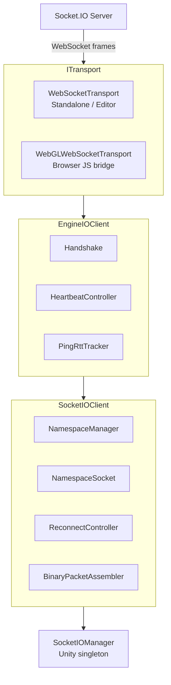

<div align="center">


# socketio-unity

**Real-time multiplayer infrastructure for Unity** — lobby systems, player synchronization, and live backend communication, all over Socket.IO v4.

WebGL-ready. Production-tested. Zero paid dependencies.

[](https://github.com/Magithar/socketio-unity/actions/workflows/ci.yml)
[](https://github.com/Magithar/socketio-unity/releases)
[](https://unity.com)
[](Documentation~/WEBGL_NOTES.md)
[](LICENSE)

</div>

---

| | |
|---|---|
| **Get Started** | [Getting Started](Documentation~/GETTING_STARTED.md) · [Quick Start](#quick-start) · [Installation](#installation) · [Dependencies](#dependencies) |
| **Demo** | [Live Demo](https://magithar.github.io/socketio-unity/) · [Videos](#demo) |
| **Learn** | [API Guide](#usage) · [Architecture](#architecture) · [API Stability](API_STABILITY.md) |
| **Samples** | [Basic Chat](#basic-chat) · [PlayerSync](#playersync) · [Lobby](#lobby) · [LiveDemo](#livedemo) |
| **Platform** | [Platforms](#supported-platforms) · [WebGL](#webgl) · [Production Readiness](#production-readiness) |
| **Tools** | [Diagnostics Overlay](#diagnostics-overlay) · [Profiler](#unity-profiler-integration) · [Packet Tracing](#packet-tracing) · [Testing](#development--testing) |
| **Project** | [Changelog](CHANGELOG.md) · [Contributing](#contributing) · [License](#license) |

---

## Quick Start

**1. Install via Unity Package Manager** (`Window > Package Manager` → `+` → `Add package from git URL`):

```
https://github.com/Magithar/socketio-unity.git
```

**2. Connect and send events:**

```csharp
var socket = SocketIOManager.Instance.Socket;

socket.OnConnected += () => Debug.Log("Connected!");

socket.On("chat", msg => Debug.Log("Server: " + msg));

socket.Connect("ws://localhost:3002");
socket.Emit("chat", "Hello from Unity!");
```

**3. Run the test server:**

```bash
cd TestServer~ && npm install && npm run start:basicchat
```

Open the **Basic Chat** sample and press Play. → [Full guide](#basic-chat)

---

## Why socketio-unity?

Most Unity Socket.IO clients are closed-source, incomplete, or platform-locked. This is a clean-room, open-source alternative built from the public protocol spec.

| | socketio-unity | Typical Unity Asset |
|---|---|---|
| Open source (MIT) | **Yes** | Often closed-source |
| Socket.IO v4 full protocol | **Yes** | Partial / outdated |
| WebGL | **Verified** | Often broken |
| Binary payloads | **Yes** | Limited |
| Namespace multiplexing | **Yes** | Sometimes missing |
| ACK callbacks with timeout | **Yes** | Partial |
| Reconnect with backoff + jitter | **Yes** | Basic or hardcoded |
| Unity Profiler integration | **Yes** | No |
| CI-tested on every commit | **Yes** | Rare |

**What you can build:** multiplayer lobbies, real-time player sync, WebGL browser multiplayer, chat/notification systems, mobile multiplayer, or a signaling layer for Mirror/Netcode.

---

## Demo

**[Play Live Demo in Browser](https://magithar.github.io/socketio-unity/)** — WebGL build, no install required.

> The demo server spins down when idle. First load may take ~40 seconds to connect — this is expected.

| Sample | Video |
|---|---|
| Basic Chat | [Watch on YouTube](https://youtu.be/7dU89B9O50c) |
| Player Sync — WebGL Multiplayer | [Watch on YouTube](https://www.youtube.com/watch?v=pdLP2jB7iEE) |

---

## Installation

### Option 1: Unity Package Manager (Recommended)

1. Open Unity's Package Manager (`Window > Package Manager`)
2. Click `+` → `Add package from git URL`
3. Enter: `https://github.com/Magithar/socketio-unity.git`

### Option 2: Manual

Download or clone this repository and copy it into your project's `Packages/` directory (or add via `Add package from disk` → `package.json`).

## Dependencies

| Package | Source | Purpose |
|---|---|---|
| **Newtonsoft.Json** | `com.unity.nuget.newtonsoft-json` | JSON serialization (built into Unity 2020.1+) |
| **NativeWebSocket** | [endel/NativeWebSocket](https://github.com/endel/NativeWebSocket) | WebSocket transport |

Install NativeWebSocket via Package Manager git URL:
```
https://github.com/endel/NativeWebSocket.git#upm
```

> This project includes a modified `WebSocket.cs` from NativeWebSocket with domain reload safety fixes. See [NOTICE.md](NOTICE.md).

---

## Usage

### Scene Setup

1. Create an empty GameObject and attach `SocketIOManager`
2. The singleton persists across scenes via `DontDestroyOnLoad`

### Basic Connection

```csharp
var socket = SocketIOManager.Instance.Socket;

socket.OnConnected += () => Debug.Log("Connected");
socket.On("chat", data => Debug.Log(data));
socket.Emit("chat", "Hello from Unity!");
```

### Connection State

```csharp
// Read current state
if (socket.State == ConnectionState.Connected)
    socket.Emit("status", "online");

// React to transitions
socket.OnStateChanged += (ConnectionState state) =>
    Debug.Log($"State → {state}");
```

| State | Meaning |
|---|---|
| `Disconnected` | Not connected |
| `Connecting` | Handshake in progress |
| `Connected` | Live and operational |
| `Reconnecting` | Auto-reconnect active |

### Error Handling

```csharp
socket.OnError += (SocketError err) =>
{
    switch (err.Type)
    {
        case ErrorType.Transport:  // Network failure
        case ErrorType.Auth:       // Authentication rejected
        case ErrorType.Timeout:    // Server not responding
        case ErrorType.Protocol:   // Malformed packet
            Debug.LogError($"{err.Type}: {err.Message}");
            break;
    }
};
```

### Namespaces

```csharp
// Public namespace
var publicNs = socket.Of("/public");
publicNs.OnConnected += () => Debug.Log("/public connected");

// Authenticated namespace
var admin = socket.Of("/admin", new { token = "test-secret" });
admin.OnConnected += () => admin.Emit("ping", null, res => Debug.Log("ACK: " + res));
```

Namespaces are multiplexed over a single WebSocket and automatically reconnected after disconnects.

### Binary Events

```csharp
// Receive
socket.On("file", (byte[] data) => Debug.Log($"Received {data.Length} bytes"));

// Send with ACK
byte[] payload = File.ReadAllBytes("data.bin");
socket.Emit("upload", payload, response => Debug.Log($"Response: {response}"));
```

### ACK Callbacks

```csharp
// With custom timeout (default 5000ms)
socket.Emit("slowOp", data, response =>
{
    if (response == null) Debug.LogWarning("ACK timed out");
    else Debug.Log("Response: " + response);
}, timeoutMs: 10000);
```

### Event Cleanup

```csharp
void OnDestroy()
{
    socket?.Off("chat", chatHandler);
    socket?.Off("file", fileHandler);
}
```

### Disconnect vs Shutdown

| Scenario | Method |
|---|---|
| User logs out, may return | `Disconnect()` |
| Switching servers | `Disconnect()` then `Connect(newUrl)` |
| Application quitting | `Shutdown()` |

### Reconnect Configuration

```csharp
socket.ReconnectConfig = new ReconnectConfig
{
    initialDelay  = 1f,
    multiplier    = 2f,
    maxDelay      = 30f,
    maxAttempts   = -1,      // unlimited
    jitterPercent = 0.1f,    // prevents thundering herd
};
```

Presets: `ReconnectConfig.Default()`, `.Aggressive()`, `.Conservative()`.
Full details: [RECONNECT_BEHAVIOR.md](Documentation~/RECONNECT_BEHAVIOR.md)

### Thread Safety

All callbacks (`OnConnected`, `OnDisconnected`, `OnError`, `On()` handlers, ACK callbacks) execute on Unity's main thread via `UnityMainThreadDispatcher`.

### RTT & Throughput

```csharp
float rtt = socket.PingRttMs;
float sent = SocketIOThroughputTracker.SentBytesPerSec;
float recv = SocketIOThroughputTracker.ReceivedBytesPerSec;
```

---

## Samples

### Basic Chat

Production-ready "Hello World" — connection lifecycle, event handling, reconnection, cleanup.

```csharp
var socket = SocketIOManager.Instance.Socket;
socket.OnConnected += OnConnected;
socket.On("chat", OnChatMessage);
socket.Connect("ws://localhost:3002");
```

[Video](https://youtu.be/7dU89B9O50c) · [Full docs](Samples~/BasicChat/README.md) · Import via Package Manager → Samples → "Basic Chat"

### PlayerSync

Real-time multiplayer synchronization — position sync at 20Hz, player join/leave, network interpolation, RTT display.

```csharp
rootSocket = new SocketIOClient(TransportFactoryHelper.CreateDefault());
rootSocket.Connect("ws://localhost:3003");
var ns = rootSocket.Of("/playersync");
ns.On("existing_players", (string json) => { /* spawn remote players */ });
ns.Emit("player_move", JsonConvert.SerializeObject(movePacket));
```

[Video](https://www.youtube.com/watch?v=pdLP2jB7iEE) · [Full docs](Samples~/PlayerSync/README.md) · Import via Package Manager → Samples → "Player Sync"

### Lobby

Multiplayer lobby with host migration, session identity, reconnect grace window, and three-layer architecture (transport → state store → UI).

```
npm run start:lobby   # http://localhost:3001
```

Features: room creation, join-by-code, persistent identity across reconnects, session token auth, 10-second grace window, automatic host promotion.

[Full docs](Samples~/Lobby/README.md) · Import via Package Manager → Samples → "Lobby"

### LiveDemo

Combines Lobby and PlayerSync into a single scene — lobby room creation flows into real-time player movement via `GameOrchestrator` layer toggling.

```bash
# Single-process (recommended for deployment)
npm run start:livedemo     # :3000 — /lobby + /playersync

# Or split servers for development
npm run start:lobby        # Terminal 1 — :3001
npm run start:playersync   # Terminal 2 — :3003
```

[Full docs](Samples~/LiveDemo/README.md)

---

## Architecture



Key principles: single WebSocket connection, namespace multiplexing, tick-driven (no background threads), `IDisposable` resource cleanup, `Off()` for leak prevention.

Full architecture docs: [ARCHITECTURE.md](Documentation~/ARCHITECTURE.md)

---

## Supported Platforms

| Platform | Status |
|---|---|
| Unity Editor | Supported |
| Windows / macOS / Linux | Supported |
| WebGL | Verified |
| Android / iOS | Verified |

| Server Version | Supported |
|---|---|
| Socket.IO v4.x | Yes |
| Socket.IO v3.x / v2.x | No |
| Engine.IO long-polling | No (intentional) |

Minimum Unity version: 2019.4 LTS (core), 2020.1+ (built-in Newtonsoft.Json), 2020.2+ (Profiler Counters).

## Production Readiness

Stable public API (frozen for v1.x), CI-validated on Unity 2022.3 LTS, 38+ protocol edge-case tests, bug regression tests, WebGL and mobile verified, configurable reconnect, zero GC allocations in hot paths, main-thread safe, domain reload safe, `IDisposable` resource management.

## WebGL

WebGL support is production-verified. The `SocketIOWebGL.jslib` JavaScript bridge handles WebSocket communication in browser builds. Root and custom namespaces, binary data, auth, and reconnection all work in WebGL.

Force-refresh (`Cmd+Shift+R`) or use Incognito when iterating on WebGL builds to avoid cached JS/WASM issues.

---

## Diagnostics Overlay

```csharp
SocketIOManager.Instance.ShowDiagnostics = true;
```

Shows connection state (color-coded), RTT, active namespaces, pending ACKs, and a live event log. Throughput display requires the `SOCKETIO_PROFILER_COUNTERS` define.

## Unity Profiler Integration

Add `SOCKETIO_PROFILER` to Player Settings → Scripting Define Symbols.

| Marker | Description |
|---|---|
| `SocketIO.EngineIO.Parse` | Engine.IO packet parsing |
| `SocketIO.Event.Dispatch` | Event handler dispatch |
| `SocketIO.Binary.Assemble` | Binary frame assembly |
| `SocketIO.Ack.Resolve` | ACK resolution |
| `SocketIO.Reconnect.Tick` | Reconnection tick |

Zero cost when define is off (~20-40ns per scope when on, 0 GC).

### Profiler Counters

Add `SOCKETIO_PROFILER_COUNTERS` to Scripting Define Symbols (Unity 2020.2+).

Counters: `SocketIO.Bytes Sent`, `SocketIO.Bytes Received`, `SocketIO.Packets/sec`, `SocketIO.Active Namespaces`, `SocketIO.Pending ACKs`.

## Packet Tracing

```csharp
TraceConfig.Level = TraceLevel.Protocol; // None, Errors, Protocol, Verbose
```

Custom output via `ITraceSink`:
```csharp
SocketIOTrace.SetSink(new MyTraceSink());
```

---

## Development & Testing

### Test Servers

```bash
cd TestServer~ && npm install

npm run start:basicchat    # Port 3002
npm start                  # Port 3000 (binary/auth)
npm run start:playersync   # Port 3003
npm run start:lobby        # Port 3001
npm run start:livedemo     # Port 3000 (combined lobby + playersync)
```

### Test Suite

| Test | Type | Covers |
|---|---|---|
| `ProtocolEdgeCaseTests.cs` | Editor tool | Protocol parsing edge cases |
| `BugRegressionTests.cs` | Runtime NUnit | Binary assembler, ACK overflow, JSON degradation |
| `ReconnectConfigTests.cs` | Runtime NUnit | Defensive copy, factory presets |
| `LobbyStateIntegrationTests.cs` | Runtime NUnit | State invariants, namespace timing |
| `StressTests.cs` | EditMode NUnit | 1K events, 10MB binary, 100 ACKs, 50 reconnects |

### CI

GitHub Actions with [`game-ci/unity-test-runner`](https://github.com/game-ci/unity-test-runner) on every push/PR to `main`. Runs EditMode tests against Unity 2022.3 LTS. Requires `UNITY_LICENSE`, `UNITY_EMAIL`, `UNITY_PASSWORD` secrets.

---

## Contributing

Contributions welcome with one hard rule:

> **Clean-room only.** Do not copy or port code from the official Socket.IO JS client, any paid Unity asset, or any other existing implementation. All contributions must be original.

Open an issue first for significant changes. Include Unity version, platform, and reproduction steps in bug reports.

Full guidelines: [CONTRIBUTING.md](CONTRIBUTING.md)

## License

[MIT](LICENSE) — free for commercial and non-commercial use.
