# Mirror + Socket.IO Integration Sample

A working example of the hybrid multiplayer architecture: **Socket.IO** owns matchmaking, session identity, and server-authoritative game events; **Mirror** owns in-scene transform/physics sync between players.

The two systems run in parallel and never cross their boundaries — Socket.IO is the backend brain, Mirror is the gameplay muscle.

---

## Demo

Two Editor/standalone instances in the same lobby room. Host clicks Start Match — both cyan capsules spawn and move independently, positions synced via Mirror `NetworkTransform`.

---

## Features

- Lobby → Mirror game transition driven by a single `match_started` event
- WASD player movement synced via `NetworkTransform` (unreliable channel)
- `GameIdentityRegistry` bridges Mirror `netId` to Socket.IO `playerId` — routes backend events to the correct spawned object
- `PlayerIdentityBridge` registers each player's identity on spawn via Mirror `[Command]`, syncs the lobby display name to all clients, and drives the name label above each player
- `MirrorPlayerController` — local player input and player color only; red = you, blue = others
- `GameEventBridge` subscribes to `/game` namespace events (`score_update`, `player_killed`) and resolves them to Mirror objects. Subscribed only after `match_started` — never during lobby phase
- `MirrorGameOrchestrator` enforces the mandatory startup/teardown order with an inspector **ServerMode** dropdown — no code changes needed to switch between P2P and dedicated server
- Graceful shutdown — emits `leave_room` before stopping Mirror so the server skips its 10-second reconnect grace timer
- Dual guard against duplicate `match_started` events: `_inGame` flag + Mirror state check
- Local test server (`mirror-server.js`) with HTTP endpoints to fire game events from a browser

---

## Prerequisites

- Mirror installed (via Package Manager or `.unitypackage`)
- Lobby sample working — this sample builds on top of it (`Samples/Lobby/`)
- Node.js 14+ and npm
- **Server repo:** [socketio-unity-mirror-server](https://github.com/Magithar/socketio-unity-mirror-server) — clone alongside this project for the `mirror-server.js` backend
- **Build target: Standalone** (Mac/Windows) recommended for Editor testing — WebGL build target prevents the native KCP transport from being used in Play mode

New to this project? Start with [BasicChat](../BasicChat/README.md) → [Lobby](../Lobby/README.md) → this sample.

---

## Quick Start

**1. Start the backend** (requires [socketio-unity-mirror-server](https://github.com/Magithar/socketio-unity-mirror-server) cloned separately):

```bash
cd path/to/socketio-unity-mirror-server
npm install
npm run start:mirror   # or: npm run dev:mirror (auto-restart)
```

**2. Open Unity:**

```
Open MirrorIntegrationScene
Set Build Target to Standalone (File → Build Settings → Mac OS X / Windows → Switch Platform)
Press Play → Enter name → Create Room → Start Match
```

The cyan capsule spawns and responds to WASD input. The server terminal prints connection and identity logs.

For multiplayer: build a standalone, run it alongside the Editor, join the same room with a different name — the host clicks Start Match and both capsules appear.

---

## ServerMode — Inspector Dropdown

`MirrorGameOrchestrator` has a **ServerMode** dropdown that controls how Mirror connects when a match starts. Set it once in the inspector — no code changes needed.

| Mode | Who hosts Mirror | Use case |
|---|---|---|
| `PeerToPeer` | Room creator runs `StartHost()`, others run `StartClient()` on the host's LAN IP | Local / LAN testing |
| `DedicatedKCP` | Everyone runs `StartClient()` on `hostAddress:kcpPort` from the server | Dedicated server, native PC/Mac builds |
| `DedicatedWebSocket` | Everyone runs `StartClient()` on `hostAddress:wsPort` from the server | Dedicated server, WebGL (browser) builds |

**How the server supplies the address and ports:**

When `MIRROR_SERVER_ADDRESS`, `MIRROR_KCP_PORT`, and `MIRROR_WS_PORT` are set as environment variables on the lobby server (Render), `mirror-server.js` automatically injects them into `match_started` — no client changes required. In `PeerToPeer` mode the env vars are absent and the host's LAN IP is passed through instead.

```json
// Dedicated mode — server injects these
{ "sceneName": "GameScene", "hostAddress": "host.edgegap.net", "kcpPort": 32367, "wsPort": 31869 }

// PeerToPeer mode — host's LAN IP, ports are null
{ "sceneName": "GameScene", "hostAddress": "192.168.1.10", "kcpPort": null, "wsPort": null }
```

In `DedicatedKCP` / `DedicatedWebSocket` mode, if `kcpPort` / `wsPort` is `0` or absent, the transport uses whatever port is set in the inspector (the default). This means local testing with `DedicatedKCP` still works without env vars — just point the transport at `localhost:7777` as usual.

---

## Local Test Server

`mirror-server.js` runs on **port 3002** and extends the lobby server with:

- `/game` namespace for in-match backend events
- HTTP endpoints to fire game events from a browser while Unity is running

| URL | What it does |
|-----|-------------|
| `localhost:3002/test` | List all active rooms and player IDs |
| `localhost:3002/test/score?roomId=X&playerId=Y&score=50` | Emit `score_update` to room |
| `localhost:3002/test/kill?roomId=X&victimId=Y` | Emit `player_killed` to room |
| `localhost:3002/test/round-end?roomId=X&winnerId=Y` | Emit `round_end` to room |

The LAN IP is printed on startup — use it as `hostAddress` when testing P2P across two machines.

---

## Architecture

```mermaid
sequenceDiagram
    participant BE as Node.js Backend (Render)
    participant C1 as Client 1
    participant C2 as Client 2
    participant DS as Mirror Server (Edgegap / local)

    rect rgb(30, 40, 60)
        Note over BE,C2: Lobby Phase — Socket.IO only
        C1->>BE: connect /lobby
        C2->>BE: connect /lobby
        BE-->>C1: player_identity { playerId, sessionToken }
        BE-->>C2: player_identity { playerId, sessionToken }
        C1->>BE: create_room
        C2->>BE: join_room { code }
    end

    rect rgb(40, 55, 40)
        Note over BE,C2: Match Start — handoff to Mirror
        C1->>BE: start_match { sceneName, hostAddress }
        BE-->>C1: match_started { sceneName, hostAddress, kcpPort, wsPort }
        BE-->>C2: match_started { sceneName, hostAddress, kcpPort, wsPort }
        Note over C1: MirrorGameOrchestrator.HandleMatchStarted
        Note over C2: MirrorGameOrchestrator.HandleMatchStarted
        C1->>DS: StartClient(hostAddress:kcpPort) [DedicatedKCP]
        C2->>DS: StartClient(hostAddress:kcpPort) [DedicatedKCP]
        DS-->>C1: OnStartLocalPlayer → PlayerIdentityBridge
        DS-->>C2: OnStartLocalPlayer → PlayerIdentityBridge
        C1->>DS: CmdRegisterIdentity(playerId) + CmdSetDisplayName(name)
        C2->>DS: CmdRegisterIdentity(playerId) + CmdSetDisplayName(name)
        Note over DS: GameIdentityRegistry: netId ↔ playerId (both players)
        DS-->>C2: SyncVar socketPlayerId, _displayName
        Note over C1,C2: Name label visible above each capsule
    end

    rect rgb(55, 35, 35)
        Note over BE,DS: Game Phase — both layers active in parallel
        DS->>C1: NetworkTransform (unreliable) — position each frame
        DS->>C2: NetworkTransform (unreliable) — position each frame
        BE-->>C1: /game: score_update { playerId, score }
        BE-->>C2: /game: score_update { playerId, score }
        Note over C1,C2: GameEventBridge → GameIdentityRegistry → Mirror object
    end

    rect rgb(40, 40, 55)
        Note over BE,DS: Teardown — mandatory order
        C1->>DS: StopClient()
        C2->>DS: StopClient()
        Note over C1,C2: GameEventBridge.Cleanup() — Off() all /game handlers
        Note over C1,C2: GameIdentityRegistry.Clear()
        C1->>BE: leave_room
        C2->>BE: leave_room
        Note over BE: Server skips 10s reconnect grace window
    end
```



For the full architectural rationale and design principles, see [MIRROR_INTEGRATION.md](MIRROR_INTEGRATION.md).

### Session Timeline

#### 1. Lobby

1. Client connects to the `/lobby` namespace.
2. Server emits `player_identity { playerId, sessionToken }`.
3. Client creates or joins a room.
4. Host emits `start_match { sceneName, hostAddress }`.
5. Server broadcasts `match_started { sceneName, hostAddress, kcpPort, wsPort }` to all room members.

#### 2. Match Start — `MirrorGameOrchestrator.HandleMatchStarted`

`GameEventBridge.Subscribe()` runs first, registering all `/game` event handlers before Mirror connects. Then the server mode determines how Mirror starts:

| Mode | What happens |
|---|---|
| `PeerToPeer` | Host calls `StartHost()`. Clients call `StartClient(hostAddress)`. |
| `DedicatedKCP` | All clients set `KcpTransport.Port = kcpPort` (if > 0, via reflection), then call `StartClient(hostAddress)`. |
| `DedicatedWebSocket` | All clients set `SimpleWebTransport.Port = wsPort` (if > 0, via reflection), then call `StartClient(hostAddress)`. |

Both the Mirror and Socket.IO layers are active in parallel once connected.

#### 3. In-Game

- **Mirror** — `NetworkTransform` (unreliable channel) syncs player position every frame.
- **Socket.IO** — the `/game` namespace delivers authoritative events (`score_update`, `player_killed`, etc.). `GameEventBridge` resolves the `playerId` → `netId` via `GameIdentityRegistry`, finds the corresponding Mirror object, and applies the event.

#### 4. Teardown — `ReturnToLobby()`

1. `StopHost()` or `StopClient()` — shuts down the Mirror connection.
2. `GameEventBridge.Cleanup()` — unsubscribes all `/game` handlers.
3. `GameIdentityRegistry.Clear()` — clears the `netId ↔ playerId` map.
4. `LeaveRoom()` — signals the lobby server to skip the 10 s grace window.

---

## Scripts

All scripts are in `Samples/MirrorIntegration/Scripts/`.

### `GameIdentityRegistry.cs`

Static lookup table: Mirror `netId (uint)` ↔ Socket.IO `playerId (string)`.

```csharp
GameIdentityRegistry.Register(netId, playerId);
GameIdentityRegistry.GetNetworkObject(playerId); // → NetworkIdentity or null
GameIdentityRegistry.Clear();                    // call on ReturnToLobby + OnDisconnected
```

`GetNetworkObject` checks `NetworkServer.spawned` (host/server) first, then `NetworkClient.spawned` (client), so it works correctly in all Mirror roles.

### `PlayerIdentityBridge.cs`

`NetworkBehaviour` — attach to the Mirror player prefab.

On local player start:
1. Reads `LocalPlayerId` from `LobbyStateStore` and calls `GameIdentityRegistry.Register` via `[Command]`.
2. Resolves the display name from `LobbyStateStore.CurrentRoom.players` (falls back to `LocalPlayerId`) and syncs it to all clients via a `[SyncVar]` hook, which updates the `nameLabel` (`TMP_Text`).

> Mirror SyncVar hooks do not fire on the host when set on the server — `CmdSetDisplayName` calls the hook manually for the host case.

Assign the `NameLabel` child object to the **Name Label** field in the inspector.

Uses `FindObjectOfType` because Mirror-spawned prefabs cannot hold inspector references to scene objects.

### `MirrorPlayerController.cs`

`NetworkBehaviour` — attach to the Mirror player prefab alongside `NetworkTransform`.

Processes WASD input only when `isLocalPlayer` — remote players are driven by `NetworkTransform` replication, never by local input. Sets player color: **red** for your own player, **blue** for all others. Clamps movement to the floor bounds.

```
NetworkTransform channel: Unreliable
— player position packets are UDP, dropped packets are ignored,
  the next frame sends a fresh position anyway.
```

### `GameEventBridge.cs`

`MonoBehaviour` — attach to a persistent manager in the game scene.

**Do not subscribe in `Start()`** — the socket may not be initialized yet. Call `Subscribe()` from `MirrorGameOrchestrator.HandleMatchStarted()` instead, which is guaranteed to run after the socket is fully connected. Always caches `Action<string>` handler references and calls `Off()` in `Cleanup()` / `OnDestroy()`.

### `MirrorGameOrchestrator.cs`

`MonoBehaviour` — replaces `GameOrchestrator` for Mirror-enabled scenes.

Starts Mirror only after `store.OnMatchStarted` fires. The **ServerMode** inspector dropdown controls how Mirror connects:

- `PeerToPeer` — room creator runs `StartHost()`, others connect to their LAN IP
- `DedicatedKCP` — all clients connect to `hostAddress:kcpPort` (native builds, UDP)
- `DedicatedWebSocket` — all clients connect to `hostAddress:wsPort` (WebGL builds, WebSocket)

In `DedicatedKCP` and `DedicatedWebSocket` modes, the port is applied to the transport before `StartClient()`. If the port arrives as `0` (P2P or local dev without env vars), the transport's inspector-configured port is used unchanged.

Enforces the mandatory teardown order in `ReturnToLobby()`. Wire all fields via inspector — no singletons.

---

## MirrorPlayer Prefab Setup

| Component | Config |
|-----------|--------|
| `NetworkIdentity` | required — added automatically |
| `NetworkTransform` | **Channel: Unreliable** |
| `PlayerIdentityBridge` | **Name Label** → `NameLabel` child (`TMP_Text`) |
| `MirrorPlayerController` | Move Speed: 5, Bounds Limit: 10 |
| `BillboardCanvas` (on Canvas child) | no config — rotates canvas to face `Camera.main` each frame |
| Capsule mesh (child) | any renderer — red = local, blue = remote (set at runtime) |
| Canvas child | world-space canvas; scale 0.01 to match Unity units |
| NameLabel (child of Canvas) | TextMeshPro UI — Vertex Color: white; name synced from lobby via `PlayerIdentityBridge` |

Do **not** attach Mirror's example `Player` script — it expects inspector refs that aren't wired and will throw `NullReferenceException` on spawn.

---

## NetworkManager Setup

The sample's `NetworkManager` uses **MultiplexTransport** to support both standalone and WebGL clients:

| Component | Role |
|-----------|------|
| `NetworkManager` | Player Prefab: `MirrorPlayer`, Auto Create Player: on, Spawn Method: Random |
| `MultiplexTransport` | Routes connections to the correct transport based on protocol |
| `KcpTransport` | Standalone / Editor — UDP, default port 7777 |
| `SimpleWebTransport` | WebGL — WebSocket, default port 7778 |

> In `DedicatedKCP` / `DedicatedWebSocket` mode, `MirrorGameOrchestrator` overrides the transport port at runtime with the value from `match_started`. The inspector port is only used if the server sends `0` (local testing without env vars).

---

## Inspector Wiring (MirrorGameOrchestrator)

| Field | Assign |
|-------|--------|
| `store` | `LobbyStateStore` component |
| `lobbyNetworkManager` | `LobbyNetworkManager` component |
| `mirrorNetworkManager` | Mirror `NetworkManager` component |
| `gameEventBridge` | `GameEventBridge` component |
| `serverMode` | `PeerToPeer` / `DedicatedKCP` / `DedicatedWebSocket` |
| `lobbyLayer` | Root GameObject of lobby UI |
| `gameLayer` | Root GameObject of game world |

---

## Scene Hierarchy

```
MirrorIntegrationScene
  DemoManager                  ← GameEventBridge component lives here
    LobbyManager               ← LobbyNetworkManager + LobbyStateStore + LobbyUIController
  UI                           ← EventSystem
  LobbyLayer                   ← lobby UI, active at start
    Canvas
  GameLayer                    ← inactive at start; activated by MirrorGameOrchestrator
    NetworkManager             ← Mirror NetworkManager + MultiplexTransport (KCP + SimpleWebTransport) + MirrorPlayer prefab
    Floor
  MirrorGameOrchestrator
  Directional Light
  Main Camera
```

**GameLayer must be inactive in the scene.** If it is active when Play starts, Mirror's `NetworkManager.Awake()` runs before `MirrorGameOrchestrator` can deactivate it, initialising Mirror prematurely.

---

## Graceful Shutdown — Mandatory Order

```csharp
// Step 1 — Mirror first (sends peer disconnect before socket closes)
if (NetworkServer.active) mirrorNetworkManager.StopHost();
else mirrorNetworkManager.StopClient();

// Step 2 — Clean /game namespace handlers
gameEventBridge.Cleanup();

// Step 3 — Clear netId ↔ playerId mappings
GameIdentityRegistry.Clear();

// Step 4 — Intentional leave (server skips 10-second reconnect grace window)
lobbyNetworkManager.LeaveRoom();
```

Reversing steps 1 and 4 is the most common mistake: if you call `Shutdown()` before `StopHost()`, Mirror tries to send disconnect packets over a closed transport.

`socket.Shutdown()` is intentionally omitted — `LobbyNetworkManager.OnDestroy()` handles it, and the lobby connection may persist across scenes.

---

## Socket.IO Events Reference

| Event | Direction | Payload | Notes |
|-------|-----------|---------|-------|
| `start_match` | Client → Server | `{ sceneName, hostAddress }` | Host only; `hostAddress` = LAN IP in P2P mode |
| `match_started` | Server → Client | `{ sceneName, hostAddress, kcpPort, wsPort }` | Triggers Mirror start; ports are `null` in P2P mode |
| `score_update` | Server → Client (on `/game`) | `{ playerId, score }` | Handled by `GameEventBridge` |
| `player_killed` | Server → Client (on `/game`) | `{ victimId }` | Resolved to Mirror object via `GameIdentityRegistry` |
| `round_end` | Server → Client (on `/game`) | `{ winnerId }` | Custom — add handler to `GameEventBridge` |
| `leave_room` | Client → Server | `{}` | Emitted in `ReturnToLobby()` |

### `match_started` Payload Contract

`hostAddress` is always present (nullable). `kcpPort` and `wsPort` are `null` in P2P mode and populated only when the lobby server has `MIRROR_SERVER_ADDRESS` env vars set (dedicated server mode).

`MirrorGameOrchestrator` handles missing values:
- Port is `0` / `null` → transport uses its inspector-configured default
- `hostAddress` is null in `PeerToPeer` mode: falls back to `"localhost"` in Editor/dev builds; returns to lobby in production
- `hostAddress` is null in `DedicatedKCP` / `DedicatedWebSocket` mode: always returns to lobby with an error log

---

## Common Pitfalls

For pitfalls common to all Mirror + Socket.IO integrations (startup order, shutdown order, command validation, `StartClient()` failure), see [MIRROR_INTEGRATION.md](MIRROR_INTEGRATION.md#common-pitfalls).

Sample-specific pitfalls:

**1. Build target set to WebGL while testing in the Editor**
`TransportFactoryHelper.CreateDefault()` uses `#if UNITY_WEBGL && !UNITY_EDITOR`, so the native transport is always selected in the Editor — but switch to Standalone anyway to avoid unrelated platform-specific compilation differences.

**2. `GameEventBridge.Subscribe()` called too early**
Do not subscribe to `/game` in `Start()` — `LobbyNetworkManager.Start()` may not have run yet and `Socket` will be null. Always call `Subscribe()` from `HandleMatchStarted` after the socket is confirmed connected.

**3. Mirror example `Player` script left on prefab**
Mirror's built-in example scripts (`Assets/Mirror/Examples/`) expect inspector references that aren't wired in this project. Remove any example scripts from the `MirrorPlayer` prefab — only `PlayerIdentityBridge` and `MirrorPlayerController` are needed.

**4. ServerMode set to `DedicatedKCP` but transport is `SimpleWebTransport`**
`MirrorGameOrchestrator` walks the transport tree (including `MultiplexTransport` children) via reflection to find and set the port. If the named transport (`KcpTransport` / `SimpleWebTransport`) is not found in the hierarchy, the inspector port is used unchanged. Check the warning log: `"KcpTransport not found in transport hierarchy; using inspector port"`.

**5. Forgetting to set env vars on Render for dedicated mode**
If `MIRROR_SERVER_ADDRESS` is not set, the server treats every match as P2P and emits `kcpPort: null`. Clients in `DedicatedKCP` mode will attempt to connect with the inspector port. Set the three env vars on Render and redeploy to activate dedicated server mode.

---

## Verified Working

| Step | PeerToPeer (Editor + Standalone) | DedicatedKCP (Edgegap) |
|------|----------------------------------|------------------------|
| Both clients connect to `/lobby` | ✓ | ✓ |
| Client joins via room code | ✓ | ✓ |
| Host clicks Start Match | ✓ | ✓ |
| Both instances enter game layer | ✓ | ✓ |
| Mirror connects | ✓ KCP :7777 (local) | ✓ KCP :edgegap-port |
| Both capsules spawned | ✓ | ✓ |
| Lobby display name shown above each player | ✓ | ✓ |
| WASD movement synced via `NetworkTransform` | ✓ | ✓ |

---

## Next Steps

- Wire `score_update` / `player_killed` in `GameEventBridge` to actual HUD/game logic
- Add a Leave Game button that calls `MirrorGameOrchestrator.ReturnToLobby()`
- Add `NetworkRigidbody` or `NetworkAnimator` for physics/animation sync
- For WebGL production builds, set `ServerMode` to `DedicatedWebSocket` and ensure `MIRROR_WS_PORT` is set on Render

---

## Known Limitations

- **No host migration** — if the Mirror host disconnects (P2P mode), all clients must return to lobby and restart
- **`GameEventBridge` handlers log to console** — wire them to your game's HUD/components
- **P2P host mode requires NAT traversal** — not included; use a dedicated server for cross-machine play beyond LAN
- **WebGL + Mirror** — `DedicatedWebSocket` mode works with SimpleWebTransport; WebGL Mirror is not production-verified for high-frequency physics sync

---

## Related Documentation

| I want to... | Go here |
|---|---|
| Understand the full hybrid architecture | [MIRROR_INTEGRATION.md](MIRROR_INTEGRATION.md) |
| Set up the local test backend (mirror-server.js) | [MIRROR_INTEGRATION.md — Local Test Server](MIRROR_INTEGRATION.md#local-test-server) |
| Understand the lobby system this builds on | [Lobby/README.md](../Lobby/README.md) |
| Configure reconnection and the grace window | [RECONNECT_BEHAVIOR.md](../../../Documentation~/RECONNECT_BEHAVIOR.md) |
| Use Socket.IO in a WebGL build alongside Mirror | [WEBGL_NOTES.md](../../../Documentation~/WEBGL_NOTES.md) |
| Understand the core library architecture | [ARCHITECTURE.md](../../../Documentation~/ARCHITECTURE.md) |
